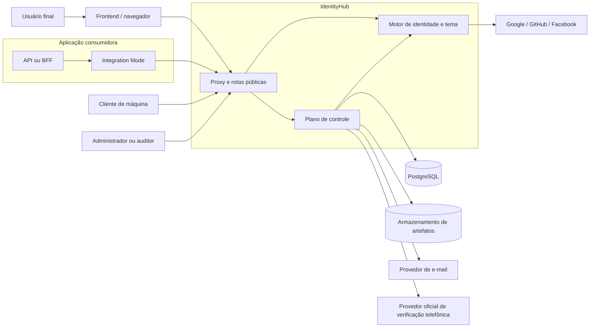
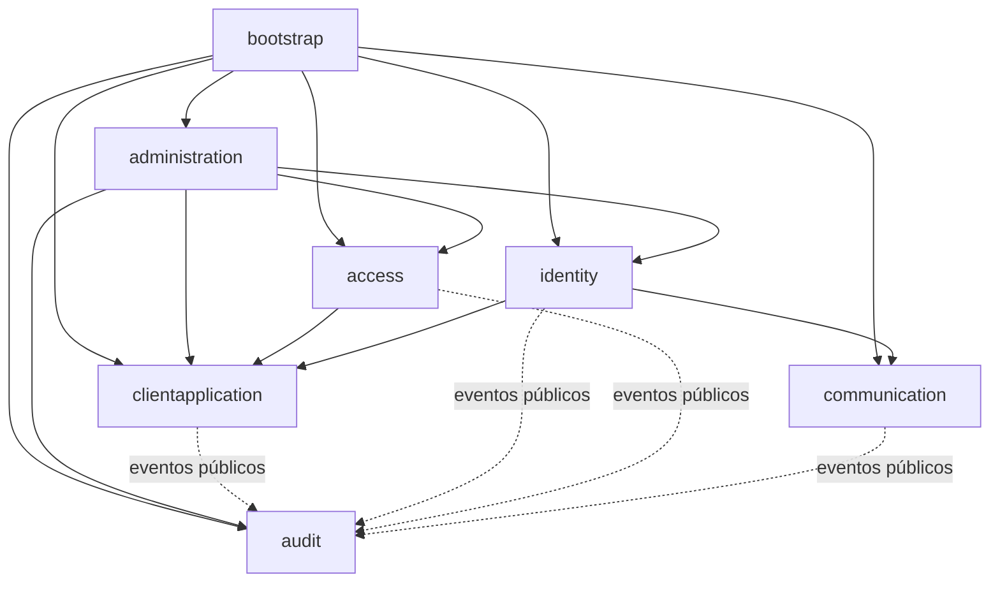
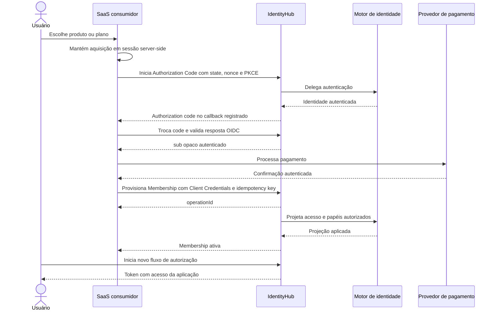

# Arquitetura do IdentityHub

> **Status:** aprovado
>
> **Versão do documento:** 1.0
>
> **Última atualização:** 2026-07-28

## 1. Finalidade

Este documento define a arquitetura lógica e operacional do IdentityHub para realizar o comportamento aprovado em `identityhub-spec.md`.

Ele descreve:

- limites do sistema;
- modos de distribuição;
- componentes executáveis;
- módulos internos;
- fontes de verdade;
- dependências permitidas;
- fluxos principais;
- consistência entre componentes;
- estratégia inicial de implantação, teste e evolução.

Parâmetros criptográficos, ameaças e políticas detalhadas pertencem a `security-model.md`. Contratos e experiência local do starter pertencem a `integration-mode.md`. Decisões arquiteturais estáveis são registradas em `adr/`.

## 2. Direcionadores

A arquitetura prioriza, nesta ordem:

1. segurança dos fluxos de identidade;
2. entrega rápida do primeiro SaaS consumidor;
3. isolamento entre aplicações;
4. simplicidade operacional para uma equipe pequena;
5. contratos estáveis e independentes do motor interno;
6. rastreabilidade e recuperação de falhas;
7. evolução futura do IdentityHub como produto comercial.

Escala horizontal, múltiplas regiões e extensibilidade genérica não justificam complexidade no MVP.

## 3. Princípios arquiteturais

### 3.1 Serviço central como modelo principal

Identidades, sessões e configurações vivem em uma instalação central por ambiente. Projetos consumidores não incorporam um servidor de autorização.

### 3.2 Motor de identidade encapsulado

Keycloak é o motor interno responsável pelos protocolos e mecanismos consolidados de identidade. Aplicações consumidoras conhecem apenas:

- o emissor e os endpoints OAuth 2.0/OpenID Connect publicados pelo IdentityHub;
- os claims documentados pelo IdentityHub;
- as APIs de gerenciamento autorizadas do IdentityHub;
- o starter e as ferramentas do Integration Mode.

Nenhum contrato consumidor pode expor classes, APIs administrativas, estruturas de banco ou formatos privados do Keycloak.

### 3.3 Modular monolith no plano de controle

As capacidades de produto serão implementadas em uma única aplicação Spring Boot implantável, organizada por módulos de negócio. Não haverá microsserviços internos no MVP.

Separação em novo serviço somente será considerada quando métricas e restrições operacionais demonstrarem necessidade concreta.

### 3.4 Separação por capacidade

O código será organizado primeiro por capacidade de negócio e depois por responsabilidade interna. Camadas técnicas globais como `controllers`, `services`, `repositories` e `utils` não serão a estrutura principal do projeto.

### 3.5 Fonte de verdade explícita

Cada informação possui um único proprietário. Projeções necessárias em outro componente são reconciliáveis e não se tornam uma segunda fonte de verdade.

### 3.6 Segurança e falha fechada

Ausência de configuração confiável, chave válida, público correto ou estado de acesso confirmado resulta em negação, nunca em liberação.

### 3.7 Consistência proporcional

Transações locais permanecem locais. Mudanças que atravessam IdentityHub e Keycloak utilizam idempotência, operação durável e reconciliação, sem tentar simular uma transação distribuída.

## 4. Contexto do sistema



O diagrama representa limites lógicos. `Integration Mode` é executado dentro da aplicação consumidora, não no ambiente central.

## 5. Modos de distribuição

### 5.1 Service Mode

Modo principal e obrigatório do MVP. É composto pelo plano de controle, motor de identidade, tema hospedado e infraestrutura de apoio.

Responsabilidades:

- operar OAuth 2.0 e OpenID Connect;
- autenticar usuários e clientes;
- manter sessões e emitir tokens;
- administrar aplicações e acesso;
- hospedar a experiência visual de identidade;
- enviar notificações essenciais;
- auditar e reconciliar operações.

### 5.2 Integration Mode

Biblioteca leve incorporada às aplicações Java/Spring consumidoras.

Responsabilidades:

- configurar validação de tokens;
- validar emissor e público;
- mapear claims públicos para authorities;
- oferecer cliente tipado opcional para operações autorizadas;
- expor diagnóstico e configuração local em desenvolvimento;
- ocultar detalhes específicos do motor interno.

O Integration Mode não armazena usuários, não emite tokens, não administra o Keycloak e não substitui o Service Mode.

### 5.3 Local Development Mode

Fica fora do MVP. Quando implementado, deverá simular ou empacotar dependências para desenvolvimento local sem alterar os contratos do Service Mode.

## 6. Planos de execução

### 6.1 Plano de protocolo e identidade

Executado principalmente pelo Keycloak e publicado sob domínios controlados pelo IdentityHub.

Responsabilidades:

- endpoints OAuth 2.0 e OpenID Connect;
- autenticação local e social;
- credenciais e verificações suportadas pelo motor;
- sessões;
- access tokens, ID tokens e refresh tokens;
- chaves de assinatura e descoberta;
- vínculo de identidades externas;
- MFA administrativo;
- renderização do tema hospedado.

Os endpoints públicos utilizam padrões abertos. Rotas administrativas, health checks privados, métricas e console do Keycloak não são publicados na internet.

### 6.2 Plano de controle

Aplicação Java/Spring Boot que representa o produto IdentityHub.

Responsabilidades:

- catálogo lógico de aplicações;
- configuração desejada de clientes;
- políticas de cadastro e contato;
- branding;
- memberships e papéis gerais;
- aquisição e provisionamento;
- administração da plataforma;
- notificações;
- auditoria suplementar;
- operações duráveis e reconciliação;
- contratos de integração.

O plano de controle usa a API administrativa suportada do Keycloak por uma identidade técnica de privilégio mínimo. Ele nunca consulta nem modifica tabelas do Keycloak.

### 6.3 Plano de integração

Executado nas aplicações consumidoras.

Responsabilidades:

- iniciar fluxos padronizados;
- proteger APIs;
- validar tokens localmente;
- traduzir papéis e escopos públicos;
- provisionar acesso com credencial de máquina quando autorizado;
- apoiar configuração e diagnóstico.

Validação local de JWT evita dependência síncrona do IdentityHub em cada requisição de negócio.

## 7. Unidades de entrega

O repositório deverá produzir apenas unidades justificadas por formas diferentes de distribuição:

| Unidade | Forma de entrega | Responsabilidade |
|---|---|---|
| `identityhub-service` | Imagem de contêiner | Plano de controle |
| `identityhub-spring-boot-starter` | Artefato Java | Integration Mode |
| `identityhub-keycloak-theme` | Artefato de tema | Experiência hospedada |

Keycloak e PostgreSQL são dependências implantadas, não módulos de código do IdentityHub.

Um módulo separado de contratos, SDK ou test support somente será criado quando possuir consumidor real e reduzir duplicação comprovada.

## 8. Módulos do plano de controle

### 8.1 `clientapplication`

Responsável por:

- `ClientApplication`;
- canais SPA, BFF, API e máquina;
- configuração desejada;
- redirect URIs e origens;
- métodos de autenticação habilitados;
- políticas de cadastro e telefone;
- branding e referências de artefatos;
- versionamento e detecção de drift.

Raiz de consistência principal: `ClientApplication`.

### 8.2 `identity`

Responsável por orquestrar capacidades de identidade sem duplicar credenciais ou perfis pertencentes ao motor:

- cadastro;
- verificação;
- login local e social;
- recuperação e alteração de senha;
- referência opaca ao usuário global;
- provisionamento idempotente de `Membership`.

O módulo trabalha com `UserAccountRef`, não com uma cópia local completa do usuário.

### 8.3 `access`

Responsável por:

- `Membership`;
- definições de papéis por aplicação;
- concessões e remoções;
- provisionamento solicitado pela aplicação;
- suspensão de acesso;
- idempotência da aquisição;
- projeção de acesso para emissão de tokens;
- reconciliação de drift.

Raiz de consistência principal: `Membership`, limitada à combinação usuário e aplicação.

Planos, preços e assinaturas não pertencem ao módulo.

### 8.4 `communication`

Responsável por:

- solicitações de notificação;
- templates transacionais;
- entrega de verificação e recuperação por e-mail;
- prova mínima de posse do telefone;
- tentativas, backoff e falha permanente;
- idempotência de entrega.

Não será criada uma abstração universal de canais. E-mail e verificação telefônica terão contratos próprios enquanto suas necessidades forem diferentes.

### 8.5 `audit`

Responsável por:

- eventos suplementares de produto e administração;
- correlação;
- consulta autorizada e visão normalizada;
- retenção e proteção contra alteração pela aplicação;
- integração com logs, métricas e tracing.

Eventos de autenticação, sessão e administração nativa permanecem no armazenamento de eventos do Keycloak, com tipos e retenção configurados. Eventos de produto, provisionamento e administração do IdentityHub permanecem no banco do plano de controle.

O módulo compõe a consulta por adaptadores autorizados e apresenta um modelo público normalizado. O histórico do Keycloak não será copiado integralmente no MVP. Exportação imutável ou ingestão própria somente será adicionada quando requisitos de retenção, volume ou conformidade justificarem.

### 8.6 `administration`

Responsável por casos de uso dos papéis:

- `PLATFORM_ADMIN`;
- `PLATFORM_AUDITOR`;
- procedimentos associados ao `BREAK_GLASS_ADMIN`.

Esse módulo coordena capacidades dos demais sem assumir seus invariantes. Ele não se torna um serviço central com lógica de todos os módulos.

### 8.7 `bootstrap`

Composition root da aplicação:

- inicialização Spring;
- configuração;
- wiring de adaptadores;
- filtros e segurança das APIs;
- jobs internos;
- health e readiness.

Não contém regras de negócio.

## 9. Dependências entre módulos



Regras:

- módulos não acessam repositórios ou entidades internas de outro módulo;
- coordenação síncrona usa casos de uso públicos pequenos;
- fatos já ocorridos podem ser propagados por eventos internos;
- consultas não justificam um barramento genérico;
- ciclos de dependência são proibidos;
- `administration` orquestra, mas não modifica agregados por acesso direto;
- `bootstrap` conhece todos os adaptadores; domínios não conhecem Spring.

## 10. Estrutura interna de cada módulo

Cada módulo poderá conter, somente quando necessário:

```text
<capability>/
  domain/
  application/
  adapter/
    in/
    out/
```

- `domain`: entidades, value objects, invariantes e eventos de domínio.
- `application`: casos de uso, comandos, resultados e portas de saída reais.
- `adapter/in`: REST, jobs e handlers de entrada.
- `adapter/out`: persistência, Keycloak, e-mail, telefone, storage e observabilidade.

Regras de simplicidade:

- não criar interface para uma única implementação sem existir limite externo ou necessidade real de substituição;
- não criar mapper quando a transformação não possui semântica;
- não criar DTO por camada automaticamente;
- usar records para contratos imutáveis quando apropriado;
- evitar repositório genérico;
- evitar pacote `common` ou `utils` como destino de conceitos sem dono;
- manter controllers finos e casos de uso responsáveis pela orquestração;
- preservar invariantes dentro dos agregados que as possuem.

## 11. Fonte de verdade e projeções

| Informação | Fonte de verdade | Projeção ou consumidor |
|---|---|---|
| Credenciais e fatores de autenticação | Keycloak | Nenhuma cópia no IdentityHub |
| Identidade global e perfil verificável | Keycloak | Referência opaca no IdentityHub quando necessária |
| Identidades sociais vinculadas | Keycloak | Eventos suplementares de auditoria |
| Sessões, refresh tokens e token families | Keycloak | Auditoria e comandos de revogação |
| Chaves e emissão de tokens | Keycloak | APIs consumidoras validam por JWKS |
| `ClientApplication` lógica | IdentityHub | Configuração projetada nos clientes do Keycloak |
| Configuração desejada de `ApplicationClient` | IdentityHub | Cliente operacional no Keycloak |
| `Membership` e concessão pretendida | IdentityHub | Papéis/atributos necessários à emissão no Keycloak |
| Definição lógica de papel | IdentityHub | Client roles no Keycloak |
| Definições normativas dos papéis de plataforma | Documentação do IdentityHub | Realm roles administrativas no Keycloak |
| Atribuições dos papéis de plataforma no MVP | Keycloak | Authorities administrativas validadas pelo IdentityHub |
| Branding e políticas | IdentityHub | Snapshot seguro consumido pelo tema |
| Logotipos e artefatos | Armazenamento de objetos | Referência no IdentityHub e leitura pelo tema |
| Eventos de autenticação e sessão | Keycloak | Visão normalizada do módulo `audit` |
| Eventos de produto e administração do IdentityHub | IdentityHub | Visão normalizada do módulo `audit` |
| Entregas pendentes | IdentityHub | Provedores externos |

Quando uma projeção divergir, a fonte de verdade indicada deve prevalecer por meio de reconciliação autorizada.

Papéis de plataforma não são projeções do plano de controle no MVP. O Keycloak
mantém suas atribuições e é consultado como autoridade para invariantes que
dependam delas, inclusive a preservação do último `PLATFORM_ADMIN` habilitado. O
IdentityHub continua sendo a superfície cotidiana para operações administrativas,
valida audience, MFA e autenticação recente, restringe quais papéis reconhece e
audita suas próprias operações. Bootstrap e recuperação emergencial usam
procedimento interno restrito; aplicações consumidoras nunca recebem permissão
para atribuir papéis de plataforma.

## 12. Persistência

### 12.1 Separação de dados

IdentityHub e Keycloak podem compartilhar a mesma instalação física PostgreSQL no MVP, mas devem utilizar:

- bancos ou schemas logicamente separados;
- usuários de banco diferentes;
- permissões sem acesso cruzado;
- ciclos de migração independentes;
- backups e restauração testados.

Não haverá foreign key, consulta ou transação atravessando os dois proprietários.

### 12.2 Migrações

Flyway gerencia exclusivamente o schema do `identityhub-service`.

O schema do Keycloak é gerenciado pelos mecanismos suportados pela própria versão implantada. Scripts Flyway do IdentityHub não modificam esse schema.

Migrações de produção devem ocorrer como etapa explícita e observável de release, antes de liberar a versão incompatível do serviço.

### 12.3 Artefatos visuais

Logotipos e outros artefatos aprovados serão armazenados fora do classpath da aplicação consumidora e fora da imagem do serviço.

O MVP deve usar um armazenamento de objetos acessível por adaptador. O provedor concreto poderá ser Supabase Storage, desde que atenda autenticação, tamanho, tipo, cache e isolamento definidos.

## 13. Contratos externos

### 13.1 Contratos padronizados

- OAuth 2.0;
- OpenID Connect;
- descoberta do emissor;
- JWKS;
- Authorization Code com PKCE;
- Client Credentials;
- logout padronizado quando aplicável.

O uso desses contratos não é considerado acoplamento ao Keycloak.

### 13.2 API de integração

API versionada do IdentityHub para:

- configuração e consulta de `ClientApplication`;
- comparação e aplicação de estado desejado;
- provisionamento idempotente de `Membership`;
- suspensão e remoção de acesso;
- consulta de status de operação.

Chamadas de aplicação utilizam OAuth Client Credentials e escopos limitados à própria `ClientApplication`.

### 13.3 API administrativa

API separada por audience e autorização para:

- administração da plataforma;
- auditoria;
- reconciliação;
- diagnóstico de falhas;
- operações de recuperação suportadas.

Ela não expõe segredos, APIs administrativas do Keycloak ou acesso genérico ao banco.

## 14. Fluxos principais

### 14.1 Cadastrar ou alterar aplicação

1. `PLATFORM_ADMIN` ou ferramenta autorizada envia configuração desejada.
2. O plano de controle valida segurança, versão e idempotência.
3. A configuração desejada e a operação são persistidas atomicamente.
4. Um worker interno aplica a projeção necessária no Keycloak.
5. Branding seguro é armazenado e referenciado nos clientes projetados.
6. A operação é marcada como aplicada ou falha.
7. Falha transitória é repetida; falha permanente fica visível para diagnóstico.
8. Reconciliação periódica detecta drift entre intenção e projeção.

### 14.2 Aquisição e provisionamento de acesso



Regras:

- o IdentityHub não recebe detalhes de pagamento;
- o SaaS não recebe senha nem credencial humana;
- o backend valida issuer, audience, assinatura, tempo, `state`, `nonce` e PKCE;
- o navegador não escolhe o `sub`, a aplicação nem a aquisição;
- a decisão comercial pertence ao SaaS;
- repetição da mesma concessão não duplica acesso;
- até a projeção ser confirmada, não há token capaz de autorizar recursos protegidos;
- papéis solicitados devem existir na aplicação e estar permitidos ao cliente de máquina.

### 14.3 Login com acesso existente

1. A aplicação inicia Authorization Code com state, nonce e PKCE quando exigido.
2. O domínio público encaminha ao motor de identidade.
3. O tema resolve branding e métodos habilitados da aplicação.
4. O motor autentica localmente ou por provedor social.
5. A `Membership` projetada determina papéis e audiência permitidos.
6. O cliente troca o código por tokens.
7. A API valida localmente assinatura, emissor, público, prazo, escopos e papéis.

### 14.4 Refresh, logout e revogação

- Keycloak controla sessão, rotação e família de refresh tokens.
- Reutilização detectada revoga a família correspondente.
- Logout encerra a sessão e impede renovação.
- Remover `Membership` ou desabilitar conta gera operação de projeção e revogação.
- Access token já emitido permanece válido até expirar, salvo mecanismo adicional definido posteriormente no modelo de segurança.

### 14.5 Notificação transacional

1. O caso de uso registra a mudança local e uma entrega pendente na mesma transação.
2. Worker interno reserva a entrega.
3. Adaptador envia ao provedor específico.
4. Sucesso encerra a entrega de forma idempotente.
5. Falha transitória agenda tentativa com backoff e limite.
6. Falha permanente fica disponível a `PLATFORM_ADMIN` e `PLATFORM_AUDITOR`.

Mailpit pode substituir o provedor de e-mail somente em desenvolvimento e testes.

### 14.6 Administração

1. O administrador autentica-se em cliente administrativo próprio com MFA.
2. O plano de controle valida audience e `PLATFORM_ADMIN`.
3. Operações sensíveis exigem autenticação recente.
4. O caso de uso delega ao módulo proprietário.
5. Resultado e contexto são auditados.

`PLATFORM_AUDITOR` utiliza o mesmo limite administrativo com permissões somente de leitura. `BREAK_GLASS_ADMIN` usa acesso privado separado e não participa do fluxo cotidiano.

## 15. Consistência, idempotência e eventos

### 15.1 Operações locais

Mudanças em um único módulo e banco usam transação local comum.

### 15.2 Operações distribuídas

Mudanças que exigem projeção no Keycloak seguem:

1. validar comando;
2. persistir intenção, chave de idempotência e operação;
3. publicar trabalho durável na mesma transação;
4. aplicar no adaptador externo;
5. registrar resultado;
6. repetir ou reconciliar quando necessário.

A API retorna identificador de operação quando a conclusão não puder ser garantida na mesma requisição.

### 15.3 Outbox

PostgreSQL outbox será usado para:

- projeções administrativas duráveis;
- notificações;
- fatos locais de auditoria que precisem sobreviver ao processo;
- eventos que precisem sobreviver ao processo;
- integração futura sem perda.

Não será utilizado para chamadas internas que podem ser simples e síncronas.

### 15.4 Sem broker no MVP

RabbitMQ, Kafka ou outro broker não fazem parte da implantação inicial. Um broker somente será introduzido se throughput, isolamento de consumidores ou integração externa demonstrarem necessidade.

### 15.5 Idempotência

Chaves de idempotência devem possuir:

- escopo por cliente e operação;
- associação ao hash semântico do comando;
- resposta estável para repetição equivalente;
- rejeição quando a mesma chave for reutilizada com conteúdo diferente;
- retenção compatível com o período de repetição esperado.

## 16. Limites de segurança

### 16.1 Superfícies públicas

Podem ser publicados por HTTPS:

- endpoints padronizados de autenticação;
- páginas hospedadas;
- APIs de integração necessárias aos SaaS, protegidas por OAuth;
- artefatos visuais públicos e imutáveis quando apropriado.

O reverse proxy deve publicar somente os caminhos necessários ao protocolo e aos recursos do tema. Caminhos administrativos, realm administrativo e interface de gerenciamento devem ser bloqueados explicitamente, mesmo quando houver hostname administrativo separado.

### 16.2 Superfícies privadas

Devem permanecer em rede privada, VPN ou túnel administrativo:

- console e API administrativa do Keycloak;
- endpoints administrativos do IdentityHub;
- métricas;
- diagnósticos detalhados;
- bancos de dados;
- acesso `BREAK_GLASS_ADMIN`.

### 16.3 Identidades técnicas

Identidades de serviço serão separadas por finalidade:

- plano de controle administrando o Keycloak;
- aplicação provisionando suas memberships;
- worker enviando notificações;
- operação de migração;
- backup e observabilidade quando necessários.

Não será usado um segredo técnico compartilhado por todas as aplicações.

### 16.4 Segredos

Segredos são fornecidos por mecanismo de secrets do ambiente e nunca:

- armazenados em arquivos versionados;
- enviados no arquivo declarativo do Integration Mode;
- incluídos em logs;
- retornados depois da janela segura de criação;
- copiados para eventos ou auditoria.

## 17. Integration Mode na arquitetura

O starter deverá:

- configurar Resource Server de maneira moderna;
- descobrir e armazenar em cache as chaves públicas;
- validar issuer e audience obrigatoriamente;
- mapear roles e scopes documentados;
- oferecer propriedades validadas na inicialização;
- falhar fechado quando não houver configuração confiável;
- oferecer cliente de provisionamento somente quando configurado;
- propagar correlação nas chamadas;
- expor console local apenas sob ativação segura.

O starter não deverá:

- incorporar regras de domínio do SaaS;
- substituir configuração explícita por heurísticas;
- chamar a API administrativa do Keycloak;
- reconfigurar produção durante cada startup;
- exigir acesso síncrono ao IdentityHub para validar cada request;
- armazenar segredos no frontend.

## 18. Tema e branding

O tema do Keycloak é um adaptador interno e pode utilizar seus mecanismos suportados de tema.

Para evitar chamada síncrona ao plano de controle em todo login:

- um snapshot de propriedades visuais seguras é projetado no runtime de autenticação;
- artefatos usam URLs controladas e validadas;
- cada canal recebe referência à mesma `ClientApplication` lógica;
- fallback local do IdentityHub permanece disponível;
- ausência do plano de controle não impede login com configuração já projetada.

JavaScript, HTML e CSS arbitrários fornecidos pelo consumidor não são aceitos.

O mecanismo exato de leitura do snapshot deve ser escolhido por spike de compatibilidade com a versão fixada do Keycloak:

1. preferir configuração suportada acessível ao tema sem extensão Java;
2. se insuficiente, usar provider interno mínimo, versionado junto ao Keycloak;
3. não introduzir chamada HTTP obrigatória ao plano de controle durante a renderização.

Templates FreeMarker e providers são artefatos confiáveis executados no processo do motor. Devem passar por revisão, testes de segurança e testes de upgrade; nunca podem ser alterados por aplicações consumidoras.

## 19. Implantação inicial

### 19.1 Ambientes

- desenvolvimento: `auth.dev.andrestamatto.dev.br`;
- produção: `auth.andrestamatto.dev.br`.

Cada ambiente possui realm, clientes, usuários, chaves, bancos lógicos, secrets e storage isolados.

### 19.2 Topologia inicial

Na VPS com Coolify:

- reverse proxy com TLS;
- `identityhub-service`;
- Keycloak em modo de produção;
- workers internos no processo do serviço;
- conexão protegida ao PostgreSQL do Supabase;
- conexão ao armazenamento de objetos;
- provedores externos de e-mail, telefone e login social.

O processo web e os workers podem compartilhar a mesma imagem e ser separados por configuração somente se a operação exigir.

### 19.3 Restrições operacionais

- limites explícitos de CPU e memória;
- pool de conexões pequeno e calibrado;
- timeouts em toda chamada externa;
- retry limitado;
- bulkheads por tipo de trabalho e circuit breaker onde chamadas repetidas possam ampliar uma indisponibilidade;
- health e readiness separados;
- backup e restauração exercitados;
- rotação de secrets e chaves planejada;
- atualização de segurança recorrente do Keycloak e das imagens.
- eventos necessários do Keycloak habilitados com retenção explícita e consulta administrativa restrita.

A VPS única é um ponto de falha aceito para o MVP, registrado como risco operacional.

## 20. Observabilidade

### 20.1 Correlação

Toda entrada recebe ou cria identificador de correlação. O contexto deve atravessar:

- APIs;
- casos de uso;
- operações duráveis;
- workers;
- chamadas ao Keycloak;
- provedores de notificação.

### 20.2 Logs

Logs estruturados devem registrar ação, resultado, aplicação, operação e correlação sem PII desnecessária ou segredos.

### 20.3 Métricas mínimas

- autenticação por resultado e método;
- emissão, refresh, logout e revogação;
- provisionamento por resultado e duração;
- drift encontrado e reconciliado;
- backlog, tentativas e falhas de outbox;
- entrega de notificação;
- latência e erro de dependências;
- uso do pool e saúde dos processos.

### 20.4 Alertas iniciais

Alertas devem priorizar:

- indisponibilidade;
- falha persistente de autenticação ou emissão;
- aumento anormal de falhas administrativas;
- reutilização de refresh token;
- backlog crescente;
- falha de reconciliação;
- expiração próxima de certificados ou secrets monitoráveis.

## 21. Estratégia de testes

### 21.1 Unidade

- invariantes de `ClientApplication` e `Membership`;
- políticas;
- idempotência;
- decisões de acesso;
- cálculo de retry;
- mapeamento de claims.

Sem containers.

### 21.2 Integração

Com Testcontainers:

- PostgreSQL real e migrações Flyway;
- Keycloak real com realm de teste;
- Mailpit para SMTP;
- adaptadores, projeções e reconciliação;
- rotação, revogação e claims.

Containers compartilham ciclo adequado por suíte; versões de imagens são fixadas.

### 21.3 Contrato

- descoberta OIDC;
- claims públicos;
- erros da API;
- idempotência;
- compatibilidade do starter;
- ausência de contratos privados do Keycloak.

### 21.4 Ponta a ponta

- cadastro e verificação;
- correlação de aquisição e pagamento simulado;
- provisionamento;
- login local e social simulado;
- PKCE;
- refresh e logout;
- MFA administrativo;
- branding;
- isolamento entre aplicações.

Provedores sociais reais são exercitados apenas em staging autorizado.

### 21.5 Regras arquiteturais

Testes automatizados de arquitetura devem impedir:

- ciclos entre módulos;
- domínio importando Spring ou adaptadores;
- acesso cruzado a repositórios internos;
- controllers contendo regras de negócio;
- dependência do starter em APIs privadas do Keycloak.

## 22. Estratégia de evolução

### 22.1 Escala vertical primeiro

O MVP começa com instâncias únicas dimensionadas e monitoradas. Ajustes de JVM, pool e recursos precedem distribuição.

### 22.2 Escala horizontal

Quando necessária:

- serviço permanece stateless fora do banco;
- jobs usam reserva concorrente segura;
- outbox evita processamento concorrente indevido;
- assets ficam fora do disco local;
- Keycloak segue sua topologia suportada;
- sessões e cache são tratados conforme requisitos do motor.

### 22.3 Extração futura

Um módulo somente se torna serviço independente quando apresentar ao menos um destes sinais:

- escala muito diferente;
- necessidade de isolamento de falha;
- ciclo de implantação independente comprovado;
- requisitos de segurança incompatíveis;
- propriedade por equipe distinta.

## 23. Alternativas rejeitadas no MVP

### Servidor de autorização próprio

Rejeitado pelo risco, tempo e custo de manter protocolos e mecanismos de segurança já consolidados.

### Embedded Mode como servidor completo

Rejeitado por duplicar identidades, chaves, sessões, atualizações e superfície de ataque em cada SaaS.

### Um realm por SaaS

Rejeitado porque fragmenta a identidade global e dificulta o futuro catálogo integrado. O isolamento será feito por aplicações, clientes, audiences, memberships e client roles.

### Microsserviço por capacidade

Rejeitado por aumentar implantação, observabilidade, latência e consistência sem benefício proporcional no MVP.

### Broker de mensagens inicial

Rejeitado porque outbox e workers internos atendem o volume e a confiabilidade esperados com menos operação.

### Banco compartilhado por acesso direto

Rejeitado porque viola propriedade dos dados, dificulta upgrades e acopla o IdentityHub ao schema privado do motor.

### Plano ou assinatura dentro do IdentityHub

Rejeitado porque aquisição e autorização de domínio pertencem ao SaaS consumidor.

## 24. Decisões detalhadas e pendentes

Os documentos complementares registram:

- ameaças, tokens, sessões, chaves, senhas, MFA e políticas em `security-model.md`;
- claims públicos, configuração declarativa, starter e console em
  `integration-mode.md`;
- sequência, gates e decisões futuras em `roadmap.md`;
- decisões arquiteturais aceitas e pendentes em `adr/`.

Estratégia concreta de storage, retenções, sizing e outros parâmetros dependentes da
implementação continuam sujeitos a ADR ou spike antes da fatia que os utilizar.
Esses detalhes devem respeitar os limites definidos aqui e ser validados
incrementalmente.

## 25. Critérios de conformidade arquitetural

Uma implementação estará em conformidade com esta arquitetura quando:

1. produzir somente as unidades de entrega aprovadas, salvo decisão posterior registrada;
2. manter o plano de controle como modular monolith sem ciclos entre módulos;
3. impedir dependência de Spring, HTTP, persistência ou Keycloak dentro dos modelos de domínio;
4. impedir que o starter utilize APIs, classes ou claims privados do Keycloak;
5. impedir acesso do IdentityHub ao schema ou às tabelas do Keycloak;
6. manter configuração desejada e projeção operacional distinguíveis e reconciliáveis;
7. demonstrar idempotência sob repetição e concorrência no provisionamento;
8. demonstrar recuperação após falha entre persistência local e projeção no Keycloak;
9. validar tokens localmente nas APIs consumidoras sem chamada remota por request;
10. bloquear externamente superfícies administrativas e de gerenciamento;
11. manter login funcional com o último snapshot válido de branding durante indisponibilidade do plano de controle;
12. executar testes automatizados de limites, integração, contratos e fluxos críticos.

Violações intencionais exigem ADR aprovado antes da implementação.

## 26. Referências técnicas

- [Keycloak — Configuring the hostname](https://www.keycloak.org/server/hostname)
- [Keycloak — Configuring a reverse proxy](https://www.keycloak.org/server/reverseproxy)
- [Keycloak — Configuring for production](https://www.keycloak.org/server/configuration-production)
- [Keycloak — Server Administration Guide](https://www.keycloak.org/docs/latest/server_admin/)
- [Keycloak — Working with themes](https://www.keycloak.org/ui-customization/themes)
- [Keycloak — Admin REST API](https://www.keycloak.org/docs-api/latest/rest-api/index.html)
