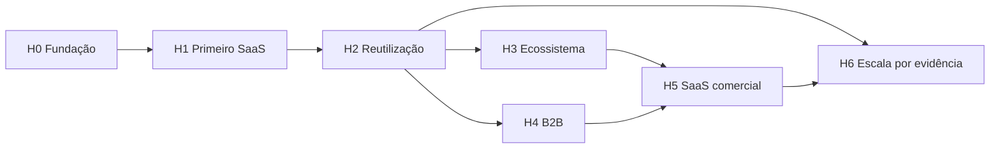

# Roadmap — IdentityHub

> **Status:** aprovado
>
> **Versão do documento:** 1.1
>
> **Última atualização:** 2026-07-29

## 1. Finalidade

Este documento organiza a evolução do IdentityHub depois da redefinição do produto.
Ele consolida o MVP aprovado, as capacidades futuras aceitas e as condições que
justificam cada avanço.

O roadmap não é uma promessa de datas. A equipe é pequena, ainda não existe uma
linha de base de entrega e o primeiro objetivo é colocar um SaaS real em produção.
Por isso, a progressão ocorre por resultados verificáveis.

## 2. Como interpretar

### 2.1 Estados

| Estado | Significado |
|---|---|
| `COMMITTED` | Necessário para concluir o MVP aprovado |
| `NEXT` | Próximo candidato após evidência produzida pelo MVP |
| `CONDITIONAL` | Aceito, mas depende de necessidade ou métrica explícita |
| `EXPLORE` | Problema reconhecido; solução ainda não escolhida |
| `REJECTED` | Fora da direção do produto enquanto os princípios atuais permanecerem |

### 2.2 Horizontes

Os horizontes expressam dependência, não duração:

1. **H0 — Fundação documental e decisões**
2. **H1 — MVP e primeiro SaaS**
3. **H2 — Reutilização e operação comprovadas**
4. **H3 — Ecossistema próprio**
5. **H4 — B2B e federação**
6. **H5 — IdentityHub como SaaS**
7. **H6 — Escala avançada**

Uma capacidade pode ser antecipada somente quando:

- desbloqueia um consumidor real;
- reduz risco crítico;
- atende obrigação operacional ou regulatória;
- ou custa menos do que contornar sua ausência.

## 3. Princípios de priorização

Nesta ordem:

1. proteger identidade, credenciais e acesso;
2. lançar o primeiro SaaS consumidor;
3. tornar o segundo SaaS mais simples que o primeiro;
4. reduzir operação manual e risco de incidente;
5. preservar contratos independentes do motor;
6. responder a uso real antes de generalizar;
7. comercializar somente após provar operação interna.

Funcionalidade interessante, mas sem consumidor, risco ou resultado observável,
permanece no horizonte correspondente.

## 4. Resultado norteador

O roadmap deve aproximar o produto desta condição:

> Um novo SaaS integra autenticação e acesso geral de forma previsível, segura e
> significativamente mais simples do que construir e operar essas capacidades
> internamente.

Os primeiros sinais quantitativos serão definidos depois da implantação inicial.
Até lá, os sinais verificáveis são:

- primeiro SaaS em produção sem integração direta com Keycloak;
- segundo SaaS integrado pelos mesmos contratos;
- isolamento entre aplicações demonstrado;
- fluxos críticos cobertos por testes e avaliação de segurança;
- incidentes e falhas diagnosticáveis sem acesso direto a bancos;
- operação compatível com a capacidade de uma equipe pequena.

## 5. Visão geral

| Horizonte | Resultado | Saída principal |
|---|---|---|
| H0 | Decisões implementáveis | Documentação aprovada e ADRs |
| H1 | Primeiro SaaS autenticando com segurança | MVP operacional |
| H2 | Integração repetível e operação estável | Segundo consumidor e baseline real |
| H3 | Identidade comum do portfólio | Experiência integrada entre produtos |
| H4 | Atendimento B2B sem contaminar o núcleo B2C | Organizações e federação |
| H5 | Oferta segura a terceiros | Produto comercial operável |
| H6 | Crescimento sem perda de segurança | HA, escala e isolamento avançados |

## 6. H0 — Fundação documental e decisões

**Estado:** `COMMITTED`

### 6.1 Objetivo

Transformar o brainstorming em contratos suficientes para orientar implementação
incremental e impedir retorno acidental à arquitetura abandonada.

### 6.2 Entregas

- `product-vision.md`;
- `identityhub-spec.md`;
- `architecture.md`;
- `security-model.md`;
- `integration-mode.md`;
- este `roadmap.md`;
- ADRs das decisões estruturais;
- contexto de posicionamento em `.agents/product-marketing.md`;
- [estratégia de migração](migration-strategy.md) da implementação atual;
- [baseline técnica anterior à refatoração](assessments/pre-refactor-baseline.md);
- correção dos bloqueadores da baseline para obter build, testes e análise
  estática verdes antes da refatoração.

### 6.3 ADRs mínimos

- Keycloak como motor interno encapsulado;
- identidade global por ambiente e acesso por membership;
- Service Mode, Integration Mode e Local Development Mode futuro;
- um realm por ambiente;
- modular monolith no plano de controle;
- PostgreSQL outbox antes de broker;
- linha inicial de Java e Spring Boot;
- formato público de claims;
- fluxo administrativo do console local;
- estratégia de branding no runtime do Keycloak.

### 6.4 Gate de saída

- documentação aprovada sem contradições bloqueantes;
- decisões pendentes classificadas como ADR, spike ou roadmap;
- primeira fatia de implementação definida por comportamento, não por estrutura
  antiga.

## 7. H1 — MVP e primeiro SaaS

**Estado:** `COMMITTED`

### 7.1 Resultado

Um SaaS real utiliza o IdentityHub em produção para cadastro, autenticação,
provisionamento de membership e proteção de API.

### 7.2 Sequência de entrega sugerida

Esta sequência não autoriza implementação horizontal ou big bang. Cada bloco deve
ser decomposto em uma fatia vertical pequena, orientada por um requisito
`IH-MVP-*`, com:

1. cenário ou teste de aceitação;
2. teste automatizado no nível adequado;
3. implementação mínima;
4. refatoração;
5. atualização documental necessária;
6. gate final supervisionado ou autônomo controlado antes da próxima fatia.

Cada branch e PR deve possuir um contexto revisável. Infraestrutura compartilhada
entra somente quando a fatia atual realmente precisar dela.

#### Fundação executável

- reorganizar o repositório nas unidades aprovadas;
- selecionar versões fixadas de Java, Spring Boot, Keycloak e PostgreSQL;
- criar ambientes independentes de desenvolvimento e produção;
- configurar Flyway somente para o schema do IdentityHub;
- estabelecer Testcontainers, arquitetura testável e pipeline básico;
- criar observabilidade, correlation ID e health desde a primeira fatia.

#### Aplicações e projeção

- cadastrar `ClientApplication`;
- configurar SPA, BFF, API e cliente de máquina;
- manter configuração desejada e estado projetado;
- detectar e reconciliar drift;
- proteger credenciais e superfícies administrativas.

#### Identidade e autenticação

- cadastro por e-mail e senha;
- verificação de e-mail;
- login por senha;
- Google, GitHub e Facebook;
- vínculo social seguro por `issuer + subject`;
- recuperação e alteração de senha;
- telefone de contato opcional ou obrigatório com prova mínima de posse.

#### Acesso e aquisição

- correlação de aquisição por OIDC no backend ou BFF consumidor;
- provisionamento idempotente pela aplicação após sua decisão comercial;
- concessão, suspensão e remoção de `Membership`;
- papéis isolados por aplicação;
- emissão de token somente para acesso projetado;
- nenhuma regra de plano ou pagamento dentro do IdentityHub.

#### Sessões e tokens

- Authorization Code e PKCE;
- Client Credentials;
- JWT público estável;
- refresh token com rotação e detecção de reutilização;
- logout e revogação;
- testes de replay, concorrência e audience.

#### Experiência hospedada

- tema IdentityHub para Keycloak;
- branding seguro por aplicação;
- tema claro, escuro e preferência do sistema;
- fallback do IdentityHub;
- login funcional com último snapshot válido.

#### Integration Mode

- starter Servlet para Java 21;
- validação de issuer, audience, assinatura e tempo;
- mapeamento de `scope` e `roles`;
- cliente tipado opcional;
- manifesto declarativo sem segredos;
- console local com validate, diff e apply;
- independência de classes e claims privados do Keycloak.

#### Operação e segurança

- `PLATFORM_ADMIN`, `PLATFORM_AUDITOR` e `BREAK_GLASS_ADMIN`;
- MFA TOTP obrigatório para administração;
- notificações essenciais por e-mail;
- outbox e workers no PostgreSQL;
- auditoria composta e alertas críticos;
- backups e restauração;
- scans de dependência, secrets e imagem;
- checklist ASVS;
- ZAP e pentest grey-box;
- gates definidos no modelo de segurança.

### 7.3 Gate de saída

Todos os cenários de aceitação do `identityhub-spec.md` foram demonstrados em
ambiente equivalente a produção, e:

- o primeiro SaaS funciona sem contrato privado do Keycloak;
- um rollback ou restauração foi exercitado;
- nenhum finding crítico ou alto permanece aberto;
- o acesso administrativo interno não está público;
- a versão candidata passou pelos spikes obrigatórios de compatibilidade.

## 8. H2 — Reutilização e operação comprovadas

**Estado:** `NEXT`

### 8.1 Resultado

Um segundo SaaS é integrado sem copiar a solução do primeiro, e o uso real fornece
baseline para confiabilidade, desempenho e esforço de integração.

### 8.2 Iniciativas

#### Segunda integração

- integrar aplicação com perfil diferente da primeira;
- medir tempo e intervenções manuais;
- identificar configuração repetitiva;
- validar compatibilidade do starter;
- transformar somente duplicações comprovadas em contrato reutilizável.

#### Developer experience

- quickstart oficial;
- exemplos de SPA, BFF, API e máquina;
- mensagens de erro e diagnóstico refinados;
- schema e autocomplete do manifesto;
- guia de migração entre versões;
- artefato de test support somente se reduzir duplicação real;
- suporte WebFlux condicionado a consumidor concreto.

#### Operação

- SLOs e alertas baseados na primeira linha de base;
- retenção de auditoria e idempotência;
- capacity planning;
- recuperação documentada;
- rotação automatizada de secrets e chaves onde suportado;
- atualização recorrente do Keycloak;
- pentest após mudanças críticas.

#### Segurança do usuário

- avaliar MFA opcional para usuários finais;
- avaliar códigos de recuperação para usuários finais;
- detecção de credenciais comprometidas;
- proteção anti-bot proporcional ao abuso observado.

### 8.3 Gate de saída

- dois SaaS usam os mesmos contratos;
- esforço da segunda integração é menor e mensurado;
- disponibilidade, latência, erro e backlog possuem baseline;
- runbooks principais foram exercitados;
- prioridades seguintes usam dados reais.

## 9. H3 — Ecossistema próprio

**Estado:** `CONDITIONAL`

### 9.1 Resultado

O IdentityHub torna-se a camada comum de identidade do portfólio sem conceder
acesso implícito entre produtos.

### 9.2 Catálogo de SaaS

- experiência que apresenta produtos disponíveis ao usuário;
- identidade global reutilizada;
- membership explícita por produto;
- aquisição e pagamento permanecem nos produtos ou serviço comercial próprio;
- catálogo não transforma existência da conta em direito de acesso;
- consentimento e compartilhamento de dados permanecem por finalidade.

### 9.3 Experiência integrada

- SSO percebido entre produtos quando fizer sentido;
- seletor ou descoberta de aplicações;
- gestão das memberships próprias pelo usuário;
- logout coerente entre aplicações participantes;
- comunicação clara sobre qual produto receberá acesso;
- nenhuma audience ou role compartilhada por conveniência.

### 9.4 Local Development Mode

- ambiente descartável para desenvolvimento;
- contratos iguais aos do Service Mode;
- realm e dados sintéticos;
- inicialização previsível;
- integração com Testcontainers ou composição local;
- nenhuma promessa de equivalência de segurança com produção;
- sem transformar o starter em servidor de autorização.

### 9.5 Canais e plataformas

- SDK ou guia para aplicações móveis;
- armazenamento seguro de tokens no dispositivo;
- deep links e redirect URIs próprios;
- SDKs para outras stacks somente quando houver consumidor;
- WebFlux se ainda não tiver sido introduzido no H2.

### 9.6 Comunicação

- SMS transacional;
- WhatsApp transacional;
- preferência de canal;
- consentimento separado por finalidade;
- fallback e custo por mensagem;
- templates versionados;
- provedores oficiais;
- Mailpit permanece ferramenta local, não serviço de produção.

### 9.7 Gate de entrada

Este horizonte começa somente quando houver pelo menos dois produtos ativos e uma
necessidade concreta de experiência cruzada.

## 10. H4 — B2B e federação

**Estado:** `CONDITIONAL`

### 10.1 Resultado

Atender produtos multiempresa sem alterar a semântica da identidade global ou
transferir autorização contextual dos SaaS para o IdentityHub.

### 10.2 Modelo organizacional

Novos conceitos candidatos:

- `Organization`;
- `OrganizationMembership`;
- papéis organizacionais gerais;
- convite;
- ciclo de entrada e saída;
- propriedade e administradores da organização;
- delegação administrativa limitada;
- vínculo entre organização e `ClientApplication`.

Esses conceitos exigem novo bounded context ou extensão explícita do contexto de
acesso. Eles não devem ser adicionados como campos opcionais em `UserAccount` ou
`Membership`.

### 10.3 Capacidades

- criação e administração de organizações;
- equipes ou grupos;
- convites com expiração;
- domínio verificado;
- delegação por aplicação;
- auditoria por organização;
- políticas de ciclo de vida;
- descoberta controlada de usuários;
- limites de administração definidos pelo produto consumidor.

### 10.4 Federação empresarial

- OIDC externo;
- SAML quando houver demanda;
- mapeamento seguro de atributos;
- política por organização;
- prevenção de account takeover por associação automática;
- eventual SCIM para provisionamento;
- desprovisionamento rastreável.

### 10.5 Limite permanente

O IdentityHub pode fornecer organização, vínculo e papel geral. Regras como
aprovação de despesa, acesso a projeto ou propriedade de documento continuam no
domínio do SaaS.

### 10.6 Gate de entrada

- primeiro produto B2B identificado;
- modelo de tenancy desse produto compreendido;
- ao menos dois casos reais demonstram que a abstração pertence ao IdentityHub;
- threat model e privacidade atualizados.

## 11. H5 — IdentityHub como SaaS

**Estado:** `EXPLORE`

### 11.1 Resultado

Oferecer o IdentityHub a desenvolvedores e pequenas equipes sem expor a operação
interna do motor e sem depender de suporte manual intensivo.

### 11.2 Descoberta de produto

Antes de construir:

- entrevistas com desenvolvedores independentes e pequenas equipes;
- análise de alternativas e motivos de troca;
- definição de ICP;
- validação da proposta de valor;
- disposição a pagar;
- modelo de suporte sustentável;
- requisitos legais e de privacidade dos mercados atendidos.

### 11.3 Capacidades comerciais

- onboarding self-service de cliente;
- conta comercial separada de `UserAccount` de produto;
- console administrativo comercial em React;
- criação segura de ambientes e aplicações;
- planos, quotas e medição de uso;
- cobrança e tributação;
- trial e encerramento;
- gestão de credenciais;
- suporte e comunicação de incidentes;
- termos, privacidade e processamento de dados;
- exportação e exclusão;
- status page;
- SLA e política de suporte.

Cobrança e plano do IdentityHub pertencem a um contexto comercial próprio. Eles não
devem ser adicionados ao aggregate `Membership` usado pelos SaaS consumidores.

### 11.4 Isolamento para clientes externos

- modelo explícito de tenant comercial;
- limites de consulta e administração;
- quotas contra noisy neighbor;
- chaves e secrets por ambiente;
- domínio de autenticação personalizado;
- credenciais próprias de Google, GitHub e Meta;
- retenção configurável;
- trilha de auditoria exportável;
- limites para branding e provedores.

### 11.5 Migração

- importação de usuários;
- migração gradual de hashes somente quando formato e segurança permitirem;
- convite ou redefinição quando hash não puder ser migrado;
- reconciliação e relatório;
- rollback;
- nenhuma coleta de senha em texto.

### 11.6 Gate de entrada

- ecossistema próprio operado de forma estável;
- demanda externa validada;
- custo por tenant conhecido;
- modelo de suporte e incidentes viável;
- revisão legal e de segurança concluída;
- pentest independente aprovado.

## 12. H6 — Escala avançada

**Estado:** `CONDITIONAL`

### 12.1 Escala horizontal

Antes de distribuir componentes:

- otimizar JVM, queries, índices, pool e cache;
- medir CPU, memória, latência e contenção;
- calibrar workers;
- remover estado local incompatível;
- comprovar gargalo por carga representativa.

Quando necessário:

- múltiplas instâncias do plano de controle;
- reserva concorrente segura de jobs;
- storage compartilhado;
- topologia suportada de Keycloak;
- sessões e caches compatíveis;
- deploy sem perda de eventos.

### 12.2 Broker de mensagens

PostgreSQL outbox e workers permanecem padrão.

Broker passa a ser candidato quando ocorrer ao menos um:

- backlog ou latência não atendidos após otimização;
- consumidores independentes reais;
- necessidade de isolamento de falha;
- throughput incompatível com polling;
- replay ou retenção de eventos como requisito de negócio;
- implantação independente comprovada.

Preferência inicial:

1. avaliar RabbitMQ para roteamento e filas operacionais simples;
2. avaliar Kafka somente quando volume, retenção e replay justificarem seu custo;
3. preservar outbox transacional na publicação;
4. exigir idempotência, retry limitado, DLQ e observabilidade.

### 12.3 Extração de serviços

Um módulo pode tornar-se serviço somente se demonstrar:

- escala muito diferente;
- requisito de segurança incompatível;
- isolamento de falha necessário;
- ciclo de implantação independente;
- propriedade por equipe distinta.

Extração não deve alterar linguagem de domínio nem expor banco compartilhado.

### 12.4 Alta disponibilidade e regiões

- banco com alta disponibilidade e recuperação point-in-time;
- múltiplas instâncias;
- estratégia de cache e sessões do Keycloak;
- storage resiliente;
- failover exercitado;
- RTO e RPO definidos;
- região adicional somente por latência, residência de dados ou continuidade;
- análise de consistência antes de active-active.

## 13. Trilha contínua de segurança

Segurança não espera um horizonte isolado.

### Após o MVP

- WebAuthn ou passkeys para administração;
- MFA opcional e depois políticas por aplicação para usuários finais;
- serviço de detecção de senhas comprometidas;
- pentest recorrente;
- processo de divulgação de vulnerabilidade.

### Conforme o risco

- `private_key_jwt` para clientes de máquina;
- mTLS ou DPoP para sender-constrained tokens;
- introspecção ou denylist seletiva;
- WAF e proteção anti-bot;
- SIEM;
- retenção imutável de auditoria;
- KMS ou HSM;
- step-up authentication por operação.

Cada item exige threat model atualizado e benefício superior ao custo operacional.

## 14. Trilha de identidade e provedores

### Aceito para evolução

- novos provedores OIDC quando houver consumidor;
- Apple ou Microsoft mediante demanda;
- credenciais de provedor próprias por cliente comercial;
- federação empresarial no horizonte B2B;
- vínculo e desvínculo seguros;
- passkeys e autenticação sem senha.

### Instagram e integrações de negócio

Login genérico com Instagram não está planejado enquanto não existir contrato
oficial adequado ao caso.

Publicação, métricas, comentários e gestão de redes sociais não pertencem ao núcleo
de identidade. Se um Micro-SaaS precisar dessas funções, ele deve integrar as APIs
de negócio da Meta em seu próprio bounded context. O IdentityHub pode autenticar o
usuário desse produto, mas não se torna plataforma genérica de social media.

## 15. Trilha de experiência e branding

### Evoluções aceitas

- mais tokens visuais seguros;
- preview e validação melhores;
- domínio de autenticação customizado para clientes comerciais;
- acessibilidade continuamente verificada;
- localização de textos;
- biblioteca de templates mantidos pelo IdentityHub.

### Limite

HTML, JavaScript e CSS arbitrários fornecidos por consumidores permanecem
rejeitados. Uma necessidade real de customização deve ser atendida por opções
declarativas seguras ou tema revisado e distribuído pelo IdentityHub.

## 16. Trilha de dados e privacidade

- política de retenção por categoria;
- exportação de dados;
- exclusão e anonimização;
- legal hold;
- consentimento por finalidade;
- registro de base legal quando aplicável;
- residência de dados quando houver mercado que exija;
- backups com ciclo de retenção e exclusão;
- ambientes não produtivos sem cópia irrestrita de dados reais.

As exigências concretas serão detalhadas antes da oferta a terceiros.

## 17. O que não entra no roadmap atual

**Estado:** `REJECTED`

- servidor OAuth/OIDC próprio dentro deste projeto;
- Embedded Mode com servidor completo em cada SaaS;
- um realm por SaaS como estratégia padrão;
- acesso direto ao banco do Keycloak;
- microsserviço por capacidade sem evidência;
- autorização contextual do domínio consumidor;
- plano e assinatura do SaaS consumidor dentro do IdentityHub;
- membership automática pela simples existência da identidade;
- segredo técnico compartilhado entre aplicações;
- customização executável arbitrária;
- token sem audience explícita;
- relaxamento de segurança para facilitar integração.

Um motor próprio, se algum dia for desejado, deve nascer como projeto independente
e implementar os contratos públicos do IdentityHub.

## 18. Gestão do roadmap

### 18.1 Entrada de iniciativa

Toda proposta registra:

- problema observado;
- pessoa ou sistema afetado;
- evidência;
- resultado esperado;
- risco de não fazer;
- dependências;
- custo operacional;
- impacto de segurança e privacidade;
- métrica ou critério de conclusão.

### 18.2 Promoção

Uma iniciativa avança quando:

- seu gate de entrada foi satisfeito;
- existe capacidade de entrega;
- requisitos e critérios de aceitação foram documentados;
- ameaças relevantes foram avaliadas;
- ADR foi aprovado quando houver decisão estrutural.

### 18.3 Remoção

Uma iniciativa pode ser removida quando:

- a necessidade deixou de existir;
- alternativa externa resolve melhor;
- o custo supera o valor;
- conflita com os princípios do produto;
- evidência contradiz a hipótese.

Roadmap não é inventário permanente de promessas.

## 19. Métricas futuras

Após a primeira produção, medir:

### Integração

- tempo até primeira autenticação;
- tempo até primeira API protegida;
- quantidade de configuração manual;
- erros de integração por categoria;
- upgrades que exigem alteração no consumidor.

### Produto

- aplicações ativas;
- usuários ativos por aplicação;
- sucesso de login por método;
- recuperação de conta;
- adoção de branding e Integration Mode;
- tempo entre criação da aplicação e primeiro login.

### Operação

- disponibilidade;
- latência de endpoints críticos;
- falhas de emissão e refresh;
- backlog e idade da outbox;
- falhas de entrega;
- tempo de reconciliação;
- tempo de restauração.

### Segurança

- tentativas bloqueadas;
- reuse de refresh token;
- falhas administrativas;
- vulnerabilidades por severidade e idade;
- tempo de correção;
- findings reincidentes;
- uso de break-glass.

Métricas não devem usar dados pessoais como labels.

## 20. Dependências entre horizontes

H6 não é automaticamente o último trabalho. Uma necessidade de escala pode surgir
antes, mas somente evidência operacional autoriza antecipá-la.

## 21. Próxima revisão

Este roadmap deve ser revisto:

- após o primeiro SaaS entrar em produção;
- após a integração do segundo SaaS;
- antes de iniciar B2B;
- antes de oferecer o IdentityHub comercialmente;
- quando mudança relevante de risco, custo ou mercado ocorrer.

Cada revisão atualiza estados, gates e evidências. Ela não reescreve retroativamente
o escopo do MVP aprovado.

## 22. Rastreabilidade

- [Visão do produto](product-vision.md)
- [Especificação do MVP](identityhub-spec.md)
- [Arquitetura](architecture.md)
- [Modelo de segurança](security-model.md)
- [Integration Mode](integration-mode.md)
