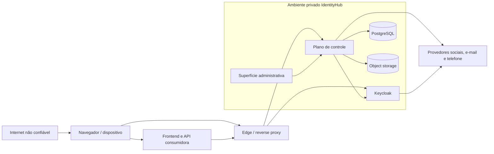

# Modelo de Segurança — IdentityHub

> **Status:** aprovado
>
> **Versão do documento:** 1.0
>
> **Última atualização:** 2026-07-28

## 1. Finalidade

Este documento define o modelo de segurança do IdentityHub para o MVP descrito em `identityhub-spec.md` e para a arquitetura definida em `architecture.md`.

Ele estabelece:

- ativos e fronteiras de confiança;
- adversários e ameaças relevantes;
- protocolos permitidos e proibidos;
- parâmetros iniciais de tokens, sessões e provas temporárias;
- políticas de credenciais e MFA;
- controles de aplicações, APIs, navegador e infraestrutura;
- proteção de administração, dados e integrações;
- verificação, pentest, release e resposta a incidentes;
- riscos residuais aceitos.

Este modelo não substitui análise de risco por aplicação consumidora. Cada SaaS continua responsável pela segurança do próprio domínio, frontend, API, pagamento e dados de negócio.

## 2. Objetivos de segurança

O IdentityHub deve preservar:

1. **confidencialidade:** credenciais, tokens, segredos, dados pessoais e eventos sensíveis não são expostos a partes não autorizadas;
2. **integridade:** identidades, memberships, papéis, aplicações e configurações não são alterados sem autorização;
3. **disponibilidade:** abuso ou falha de dependência é contido sem ampliar indisponibilidade desnecessária;
4. **autenticidade:** usuários, aplicações e operadores são identificados por mecanismos adequados ao risco;
5. **isolamento:** acesso ou configuração de uma aplicação não concede capacidade sobre outra;
6. **rastreabilidade:** operações relevantes possuem autoria, resultado, instante e correlação;
7. **recuperabilidade:** comprometimentos e falhas podem ser contidos, revogados, reconciliados e investigados.

## 3. Premissas e limites

### 3.1 Premissas

- TLS é corretamente configurado no edge e entre componentes quando a rede não for integralmente confiável.
- Sistema operacional, imagens, Keycloak, JVM e dependências recebem atualizações de segurança.
- Segredos de produção não são reutilizados em desenvolvimento.
- O dispositivo e o navegador do usuário podem estar comprometidos.
- Aplicações consumidoras validam tokens por meio do contrato do IdentityHub.
- O SaaS protege adequadamente seus próprios webhooks de pagamento e decisões comerciais.
- Provedores sociais, e-mail, telefone, banco e storage são dependências externas potencialmente indisponíveis ou comprometíveis.

### 3.2 Limites

- JWT bearer roubado pode ser utilizado até expirar.
- Logout e remoção de acesso impedem renovação, mas não apagam um access token já distribuído.
- TOTP reduz risco de senha comprometida, mas não é resistente a phishing.
- Uma VPS única permanece ponto de falha no MVP.
- Não existe segurança absoluta contra comprometimento total do host ou da conta raiz da infraestrutura.

## 4. Ativos protegidos

| Ativo | Impacto de comprometimento |
|---|---|
| Senhas e hashes | Tomada de contas e reutilização em outros serviços |
| Fatores TOTP e recovery codes | Bypass de MFA administrativo |
| Chaves privadas de assinatura | Emissão arbitrária de tokens |
| Refresh tokens e sessões | Persistência de acesso indevido |
| Access tokens e ID tokens | Acesso temporário ou exposição de identidade |
| Segredos de clientes e provedores | Personificação de aplicação ou abuso de integração |
| Correlação OIDC de aquisição | Provisionamento indevido de membership |
| Identidade global e contatos | Fraude, privacidade e correlação entre produtos |
| Memberships e papéis | Elevação de privilégio e acesso entre SaaS |
| Configuração de aplicações | Redirect malicioso, audience confusion e sequestro de fluxo |
| Papéis administrativos | Comprometimento de todo o ambiente |
| Auditoria | Repúdio e ocultação de ataque |
| Branding e artefatos | XSS, conteúdo malicioso e fraude visual |
| Backups e dados persistidos | Comprometimento em massa e perda operacional |

## 5. Fronteiras de confiança

Toda seta que cruza uma fronteira exige autenticação, autorização, validação, timeout e observabilidade proporcionais ao risco.

## 6. Adversários considerados

- atacante externo sem conta;
- usuário legítimo tentando ampliar o próprio acesso;
- bot de credential stuffing ou criação abusiva de contas;
- aplicação consumidora maliciosa ou comprometida;
- segredo de cliente de máquina vazado;
- frontend comprometido por XSS ou dependência maliciosa;
- operador administrativo comprometido;
- colaborador ou processo interno com privilégio excessivo;
- provedor externo comprometido ou indisponível;
- atacante com acesso a backup, log ou storage;
- dependência, imagem ou pipeline de supply chain comprometido;
- atacante com capacidade de interceptar ou manipular tráfego mal configurado.

## 7. Análise de ameaças

### 7.1 Spoofing

| Ameaça | Controles principais |
|---|---|
| Credential stuffing | Senha forte, blocklist, rate limit, proteção adaptativa e resposta genérica |
| Personificação de cliente | Client authentication, segredo exclusivo, audience e escopo por aplicação |
| Sequestro de authorization code | PKCE S256, state, nonce, código curto e URI exata |
| Vínculo social incorreto | Chave `issuer + subject`, reautenticação e proibição de link por e-mail |
| Roubo de sessão administrativa | MFA, cookie protegido, sessão curta e reautenticação |

### 7.2 Tampering

| Ameaça | Controles principais |
|---|---|
| Alteração de JWT | Assinatura assimétrica e allowlist de algoritmo |
| Alteração de configuração | Autorização, versionamento, idempotência, auditoria e reconciliação |
| Membership forjada | Client Credentials, `sub` obtido de OIDC validado, escopo por aplicação e papéis permitidos |
| Replay na aquisição | Authorization code de uso único, `state`, `nonce`, PKCE e correlação server-side |
| Upload malicioso | Tipos raster permitidos, reprocessamento, limites e storage isolado |

### 7.3 Repudiation

| Ameaça | Controles principais |
|---|---|
| Negação de operação administrativa | MFA, identidade individual, auditoria e correlação |
| Negação de provisionamento | Client identity, idempotency key, payload hash e resultado persistido |
| Alteração ou exclusão de trilha | API sem exclusão comum, acesso restrito e backups |

### 7.4 Information disclosure

| Ameaça | Controles principais |
|---|---|
| Enumeração de contas | Mensagens e tempos públicos equivalentes |
| PII em tokens | Claims mínimos, scopes e audience |
| Token ou segredo em log | Redação central, logging estruturado e testes |
| Vazamento por browser storage | BFF preferencial e proibição de tokens em Web Storage |
| Exposição cross-application | Audience, client roles, memberships e consultas escopadas |

### 7.5 Denial of service

| Ameaça | Controles principais |
|---|---|
| Login e reset massivos | Rate limit no edge e no motor, backoff e quotas |
| Exaustão por hashing | Limites concorrentes e parâmetros calibrados |
| Provider outage | Timeout, circuit breaker, bulkhead e degradação controlada |
| Outbox crescente | Métrica, limite de tentativas, alerta e operação de recuperação |
| Upload excessivo | Limite de corpo, dimensão e frequência |

### 7.6 Elevation of privilege

| Ameaça | Controles principais |
|---|---|
| Token da aplicação A usado na B | Validação obrigatória de audience |
| Aplicação concede role global | Escopos limitados e rejeição de papéis de plataforma |
| Auditor executa mutação | Cliente administrativo e authorities separados |
| Admin cotidiano acessa motor | Proxy privado e identidade técnica dedicada |
| Mass assignment em APIs | Comandos explícitos e allowlist de campos |

### 7.7 Supply chain e infraestrutura

| Ameaça | Controles principais |
|---|---|
| Imagem ou dependência vulnerável | Versão fixada, scanning, SBOM e atualização recorrente |
| Pipeline comprometido | Privilégio mínimo, proteção de branch e secrets isolados |
| Backup exposto | Criptografia, acesso separado e teste de restauração |
| Proxy mal configurado | Hostname fixo, trusted proxies e teste externo de rotas |

## 8. Perfil OAuth 2.0 e OpenID Connect

### 8.1 Fluxos permitidos

- Authorization Code para aplicações de usuário;
- PKCE com `S256` para clientes públicos;
- PKCE com `S256` também para clientes confidenciais;
- Client Credentials para comunicação entre sistemas;
- refresh token somente para clientes e sessões autorizados;
- logout OIDC e back-channel logout quando o tipo de cliente suportar.

### 8.2 Fluxos proibidos

- Implicit Flow;
- Resource Owner Password Credentials ou Direct Access Grants;
- senha do usuário enviada ao projeto consumidor;
- Client Credentials representando usuário;
- refresh token para Client Credentials;
- offline token no MVP;
- token em query string, fragmento, URL de callback ou log;
- redirect URI com wildcard em produção.

### 8.3 Proteção do fluxo de autorização

- redirect URI comparada exatamente;
- HTTPS obrigatório em produção;
- `state` imprevisível e vinculado à sessão que iniciou o fluxo;
- `nonce` único quando OpenID Connect for utilizado;
- PKCE verifier aleatório por transação;
- somente `S256`;
- authorization code de uso único;
- resposta recusada se issuer, client, redirect, state, nonce ou PKCE não coincidirem;
- parâmetros não reconhecidos ou duplicados são rejeitados de forma segura.

### 8.4 Tipos de aplicação

#### SPA

- cliente público;
- Authorization Code + PKCE;
- sem client secret;
- access token somente em memória;
- refresh token somente se rotação estiver habilitada e a biblioteca puder protegê-lo adequadamente;
- BFF recomendado para aplicações de maior risco.

#### BFF ou aplicação web confidencial

- client authentication obrigatória;
- tokens permanecem no backend;
- navegador recebe somente cookie de sessão opaco;
- cookie protegido conforme seção 14.

#### API

- Resource Server;
- validação local de JWT;
- issuer, audience, algoritmo e validade obrigatórios;
- ausência de chamadas remotas por request normal.

#### Cliente de máquina

- Client Credentials;
- identidade e segredo próprios;
- audience e scopes mínimos;
- sem refresh token e sem sessão humana.

## 9. Correlação segura de aquisição

O MVP usa apenas OpenID Connect Authorization Code com PKCE para correlacionar
uma pessoa autenticada a uma aquisição. Não existe prova, sessão ou token de
onboarding proprietário.

Controles adicionais ao perfil da seção 8:

- backend ou BFF mantém a aquisição em sessão server-side;
- o callback aceita somente authorization code na redirect URI registrada;
- `sub` é aceito somente após validar a resposta OIDC completa;
- o navegador não declara `sub`, aplicação ou aquisição como autoridade;
- autenticação sem `Membership` não concede audience nem papéis de negócio;
- provisionamento posterior usa Client Credentials e idempotency key;
- pagamento, plano e assinatura não são enviados ao IdentityHub.

## 10. Perfil de tokens

### 10.1 Assinatura

- tokens assinados assimetricamente;
- baseline inicial `RS256` pela interoperabilidade;
- chave RSA de no mínimo 2048 bits;
- algoritmo aceito configurado explicitamente;
- `none` e algoritmos simétricos não são aceitos para access tokens;
- chave privada nunca é distribuída a consumidores;
- chaves públicas são publicadas por JWKS.

Uma migração futura para algoritmo diferente exige compatibilidade comprovada, rotação e ADR.

### 10.2 Claims mínimos de access token humano

- `iss`;
- `sub` opaco;
- `aud`;
- `exp`;
- `iat`;
- `jti`;
- `azp` ou identificador equivalente do cliente autorizado;
- `scope`;
- `sid` quando houver sessão;
- papéis somente da aplicação de destino.

E-mail, telefone, nome e outros dados pessoais não entram por padrão. Quando necessários, dependem de scope e finalidade documentados.

### 10.3 Claims de máquina

- sujeito representa o cliente, não um usuário;
- audience explícita;
- scopes próprios do cliente;
- nenhum papel de usuário;
- nenhuma PII humana.

### 10.4 Validação em Resource Servers

O consumidor deve:

1. aceitar somente o algoritmo configurado;
2. validar assinatura;
3. validar issuer exato;
4. exigir audience esperada;
5. validar expiração e instante de emissão;
6. rejeitar token destinado a outro tipo de uso;
7. mapear apenas claims documentados;
8. rejeitar ausência de claim obrigatório;
9. atualizar JWKS uma única vez diante de `kid` desconhecido e falhar fechado se continuar desconhecido;
10. limitar clock skew ao valor definido.

ID token não autoriza API. Access token não substitui prova de identidade em fluxos que exigem ID token.

## 11. Tempos de vida iniciais

Os valores abaixo formam a baseline do MVP. Exceções exigem justificativa, teste e registro.

| Artefato ou sessão | Baseline |
|---|---:|
| Authorization code | 60 segundos |
| Access token humano | 10 minutos |
| Access token de máquina | 5 minutos |
| Clock skew aceito | 60 segundos |
| Código de verificação de e-mail | 30 minutos |
| Prova de recuperação de senha | 15 minutos |
| Código de verificação telefônica | 5 minutos |
| Sessão de usuário inativa | 30 minutos |
| Sessão máxima de usuário | 12 horas |
| Sessão administrativa inativa | 15 minutos |
| Sessão administrativa máxima | 4 horas |
| Autenticação recente para ação sensível | 5 minutos |

`Remember Me` e offline access permanecem desabilitados no MVP.

## 12. Refresh token, sessão e logout

### 12.1 Rotação

- `Revoke Refresh Token` habilitado;
- cada uso retorna novo refresh token;
- token substituído não pode ser reutilizado;
- `Refresh Token Max Reuse` configurado como zero;
- reutilização detectada encerra a client session afetada e exige nova autenticação;
- refresh token é vinculado a usuário, cliente e sessão;
- cliente deve substituir o valor armazenado de forma atômica.

A invalidação de toda a client session após replay é requisito do IdentityHub, não uma
suposição sobre a configuração do Keycloak. Antes da primeira release, um teste de
integração concorrente deve comprovar esse comportamento na versão fixada do motor.
Se o Keycloak apenas rejeitar o token antigo sem invalidar os tokens sucessores da
sessão, o IdentityHub deve complementar a resposta com revogação explícita da
client session. A solução complementar, se necessária, exige ADR.

### 12.2 Armazenamento

- BFF mantém refresh token exclusivamente no servidor;
- SPA não usa `localStorage` nem `sessionStorage`;
- tokens nunca são persistidos em logs, analytics, crash reports ou URLs;
- armazenamento móvel será definido quando o suporte móvel entrar no roadmap.

### 12.3 Logout

- encerra sessão central e cliente correspondente;
- revoga refresh tokens da sessão;
- usa back-channel logout para clientes confidenciais quando suportado;
- post-logout redirect exige URI exata;
- access token permanece potencialmente válido até expirar;
- APIs de alto risco podem adotar introspecção ou denylist futuramente, mas isso não faz parte do caminho comum do MVP.

### 12.4 Eventos que revogam sessão

- redefinição de senha;
- desabilitação global da conta;
- reutilização de refresh token;
- resposta a comprometimento;
- remoção ou suspensão de membership para a sessão da aplicação;
- alteração administrativa de fator crítico;
- uso de procedimento break-glass quando o incidente exigir.

## 13. Política de senha

### 13.1 Regras de escolha

- mínimo de 15 caracteres para usuário final sem MFA;
- mínimo de 15 caracteres também para administração, além do MFA;
- máximo permitido de pelo menos 64 caracteres;
- espaços e Unicode aceitos;
- senha avaliada contra blocklist de valores comuns e comprometidos;
- sem exigência de maiúscula, número ou caractere especial;
- sem troca periódica;
- troca obrigatória quando houver evidência de comprometimento;
- sem dicas, perguntas secretas ou knowledge-based authentication;
- paste e gerenciadores de senha permitidos.

### 13.2 Armazenamento

- Argon2id por provider suportado do Keycloak fora de FIPS;
- baseline nunca inferior ao equivalente OWASP de 19 MiB, 2 iterações e paralelismo 1;
- parâmetros calibrados no hardware real para resistência sem exaustão do serviço;
- salt único por senha;
- pepper somente se houver armazenamento de segredo apropriado e plano de rotação;
- BCrypt aceito apenas para migração de hash legado;
- PBKDF2 aprovado somente quando exigido por operação FIPS futura.

Alteração de algoritmo ou custo deve reprocessar o hash no próximo login suportado, sem exigir recuperação da senha em texto.

### 13.3 Tratamento

- senha existe em claro somente durante a requisição estritamente necessária;
- não é armazenada em DTO persistente, evento, auditoria ou log;
- não é enviada à aplicação consumidora;
- comparação é feita somente pelo motor de identidade;
- resposta de erro não revela conta existente nem parte correta da credencial.

## 14. Segurança de navegador e cookies

### 14.1 Cookies

Cookies de sessão devem usar:

- `Secure`;
- `HttpOnly`;
- `SameSite=Lax` como baseline compatível com redirects de autenticação;
- `Path=/`;
- ausência de `Domain` sempre que possível;
- prefixo `__Host-` quando compatível;
- conteúdo opaco e não significativo;
- rotação após autenticação e elevação de privilégio.

`SameSite=None` somente é permitido quando fluxo comprovadamente exigir, sempre com `Secure` e análise específica.

### 14.2 CSRF

- `state` e PKCE protegem o retorno OAuth;
- endpoints autenticados por cookie usam token CSRF ou padrão equivalente;
- métodos seguros não alteram estado;
- Origin e Referer podem atuar como defesa adicional, não exclusiva;
- CORS não substitui proteção CSRF.

### 14.3 Cabeçalhos

- HSTS após validação completa de HTTPS;
- Content Security Policy restritiva;
- `frame-ancestors 'none'` ou allowlist estritamente necessária;
- `X-Content-Type-Options: nosniff`;
- `Referrer-Policy: no-referrer`;
- Permissions Policy restritiva;
- `Cache-Control: no-store` em respostas com dados de autenticação;
- nenhum segredo em URL.

### 14.4 CORS

- somente endpoints que realmente precisam de browser cross-origin;
- allowlist exata por aplicação;
- sem wildcard com credenciais;
- métodos e headers mínimos;
- preflight não autoriza a chamada;
- origens normalizadas e validadas no cadastro.

### 14.5 XSS

- escaping contextual;
- templates e componentes revisados;
- nenhuma personalização arbitrária de HTML, JavaScript ou CSS;
- CSP sem `unsafe-eval`;
- dependências frontend mínimas e fixadas;
- tokens não acessíveis a JavaScript quando o padrão BFF for usado.

## 15. Branding e upload de artefatos

O MVP aceita somente formatos raster necessários, inicialmente PNG, JPEG e WebP.

Controles:

- SVG rejeitado no MVP;
- limite inicial de 2 MiB;
- limites de largura, altura e quantidade de pixels;
- validação por assinatura real do arquivo, não apenas extensão;
- decodificação e re-encode antes do armazenamento;
- metadados removidos quando possível;
- nome de objeto gerado pelo servidor;
- bucket e permissões isolados;
- nenhuma URL remota é buscada pelo servidor;
- resposta com content type fixo e `nosniff`;
- artefato nunca é executado como template;
- upload e alteração são auditados.

## 16. Login social e associação de contas

### 16.1 Identidade externa

- chave única `issuer + subject`;
- e-mail é atributo, não chave de vínculo;
- provedor deve estar habilitado para a aplicação;
- redirect URI é fixo e registrado;
- state e nonce são obrigatórios conforme o protocolo;
- tokens do provedor não são entregues à aplicação consumidora.

### 16.2 Vínculo

- identidade externa conhecida resolve para o mesmo usuário;
- e-mail coincidente nunca cria vínculo automático;
- vínculo com conta existente exige sessão autenticada e autenticação recente;
- conflito gera fluxo seguro sem revelar detalhes da outra conta;
- desvincular último método de acesso é impedido sem método alternativo;
- vínculo e desvínculo são auditados e notificados.

### 16.3 Credenciais dos provedores

- uma credencial por provedor e ambiente no MVP;
- secrets no mecanismo de secrets do ambiente;
- escopos mínimos;
- produção e desenvolvimento separados;
- rotação diante de incidente ou exigência do provedor;
- BYO credentials permanece fora do MVP.

## 17. MFA administrativo

### 17.1 Baseline

- senha + TOTP obrigatório;
- TOTP compatível com Google Authenticator e aplicativos padronizados;
- configuração obrigatória no primeiro acesso;
- código TOTP não reutilizável na mesma janela;
- relógio do servidor sincronizado;
- códigos de recuperação gerados junto ao enrollment;
- ao menos 10 códigos de recuperação de uso único;
- recuperação gera auditoria e notificação;
- remoção ou reset do fator exige autenticação reforçada.

### 17.2 Limitações

TOTP não é resistente a phishing. A interface deve informar domínio correto e evitar fluxos que treinem o administrador a fornecer códigos fora do login esperado.

WebAuthn ou chave física será a evolução recomendada para administração, mas não bloqueia o MVP.

### 17.3 `BREAK_GLASS_ADMIN`

- identidade separada da conta cotidiana;
- não utilizada por automação;
- credenciais e recovery material armazenados offline;
- acesso somente por rede privada, VPN ou túnel;
- todo uso gera alerta destacado;
- senha e fator são rotacionados após uso;
- procedimento é testado de forma controlada;
- não existe credencial padrão.

## 18. Administração e privilégio mínimo

### 18.1 `PLATFORM_ADMIN`

Pode executar somente operações documentadas pelo IdentityHub. Não recebe acesso direto ao banco nem uso cotidiano do console do Keycloak.

### 18.2 `PLATFORM_AUDITOR`

- somente leitura;
- sem exportação irrestrita de PII;
- consultas sensíveis auditadas;
- não altera configuração, usuário, sessão, role ou membership.

### 18.3 Controles comuns

- cliente e audience administrativos próprios;
- MFA obrigatório;
- rede privada;
- sessão reduzida;
- reautenticação para ações sensíveis;
- nenhum compartilhamento de conta;
- proteção contra remoção do último administrador;
- impossibilidade de aplicação consumidora atribuir papel de plataforma;
- dev e produção independentes;
- sem impersonation no MVP.

### 18.4 Administração do Keycloak

- console, Admin REST API e realm administrativo bloqueados no edge público;
- hostname administrativo não é considerado controle suficiente sozinho;
- plano de controle usa service account exclusiva;
- Full Scope Allowed desabilitado;
- somente roles administrativas mínimas necessárias;
- secret ou chave técnica rotacionável;
- uso da service account monitorado.

## 19. Autorização e isolamento

### 19.1 Aplicação

- cada SaaS possui `ClientApplication` lógica;
- cada canal possui cliente próprio;
- audience identifica API destinatária;
- roles são client roles;
- membership é única por usuário e aplicação;
- nenhuma role de outra aplicação entra no token;
- máquina só gerencia memberships da própria aplicação.

### 19.2 Plataforma

- papéis de plataforma usam audience administrativo;
- não são incluídos em tokens de SaaS;
- não podem ser solicitados por cliente consumidor;
- alteração exige `PLATFORM_ADMIN` com autenticação recente;
- concessão e remoção são auditadas.

### 19.3 Domínio consumidor

O IdentityHub não decide:

- propriedade de recurso;
- plano;
- assinatura;
- limite de uso;
- direito sobre uma entidade específica;
- consentimento de marketing do SaaS.

O consumidor deve combinar identidade e papéis gerais com suas próprias regras.

## 20. Rate limiting e defesa contra abuso

Os valores são baselines iniciais e devem ser ajustados por métricas sem enfraquecer o controle.

| Operação | Baseline inicial |
|---|---|
| Login por conta | Após 5 falhas, espera progressiva de 30 segundos até 15 minutos |
| Login por IP | 20 tentativas em 5 minutos antes de limitação adicional |
| Cadastro por IP | 20 solicitações em 15 minutos |
| Recuperação por destino | 3 solicitações em 15 minutos |
| Recuperação por IP | 20 solicitações em 15 minutos |
| Reenvio de verificação | 3 solicitações em 15 minutos por destino |
| Validação de código | Máximo de 5 tentativas por código |
| Login administrativo | 5 falhas geram bloqueio temporário e alerta |
| Upload de branding | 10 operações em 10 minutos por aplicação |

Regras:

- evitar bloqueio permanente automático que permita DoS de conta;
- combinar chave por IP, conta, cliente e risco;
- resposta pública permanece genérica;
- `Retry-After` pode ser usado sem revelar existência de conta;
- limites de edge e Keycloak são complementares;
- bypass administrativo de lockout exige autenticação forte e auditoria;
- sucesso não apaga imediatamente todos os sinais de abuso;
- eventos alimentam métricas e alertas.

## 21. Verificação e recuperação

### 21.1 Códigos e links

- gerados por CSPRNG;
- uso único;
- finalidade única;
- armazenados em hash quando possível;
- comparação constante quando aplicável;
- expiração conforme seção 11;
- código anterior invalidado no reenvio;
- tentativas limitadas;
- sem valor utilizável em logs.

### 21.2 Recuperação de senha

- resposta indistinguível para conta existente ou não;
- envio somente a contato verificado;
- link aponta exclusivamente para domínio oficial;
- nova senha não é enviada por e-mail;
- redefinição revoga sessões e refresh tokens;
- usuário recebe notificação após alteração;
- recuperação não remove MFA administrativo por e-mail.

### 21.3 Telefone obrigatório

- provider oficial;
- finalidade exclusiva de prova de posse no MVP;
- número normalizado;
- código curto protegido por expiração e tentativas;
- verificação não cria consentimento para SMS, WhatsApp ou marketing;
- telefone não é identificador de login.

## 22. APIs e validação de entrada

- schemas explícitos;
- tamanho máximo de corpo;
- strings normalizadas apenas quando a semântica permitir;
- campos desconhecidos rejeitados em comandos sensíveis;
- allowlist de campos mutáveis;
- paginação e limite de resultados;
- IDs opacos;
- erros sem stack trace;
- status coerentes sem enumeração;
- idempotency key obrigatória nas operações distribuídas críticas;
- mesma chave com payload diferente rejeitada;
- timeout em chamadas externas;
- retry somente para falhas seguras e idempotentes;
- circuit breaker e bulkhead nas dependências críticas;
- SSRF prevenido por não buscar URLs fornecidas pelo consumidor.

## 23. Proteção de dados e privacidade

- minimização por finalidade;
- contatos separados de identificadores;
- PII fora de tokens por padrão;
- scopes explícitos para compartilhamento;
- dados de uma aplicação não consultáveis por outra;
- logs com pseudonimização quando possível;
- acesso administrativo a PII auditado;
- retenção definida por categoria no futuro plano de dados;
- exclusão e anonimização não podem destruir evidência que precise ser legalmente preservada;
- ambiente de desenvolvimento não usa cópia de dados reais de produção;
- backups seguem os mesmos controles de acesso dos dados primários.

## 24. Segredos e chaves

### 24.1 Armazenamento

- secrets do Coolify ou mecanismo equivalente;
- nenhum secret versionado;
- nenhum secret em imagem, log, changelog ou documentação;
- variáveis expostas somente ao processo necessário;
- credenciais separadas por serviço e ambiente;
- acesso humano excepcional e auditado.

### 24.2 Rotação

- segredo comprometido é rotacionado imediatamente;
- client secrets possuem procedimento de rotação com sobreposição controlada;
- chaves de assinatura possuem rotação planejada;
- chave pública antiga permanece em JWKS durante a validade máxima necessária;
- rotação emergencial considera invalidação de tokens e comunicação aos consumidores;
- credenciais não utilizadas são removidas.

### 24.3 Assinatura

- material privado permanece no motor de identidade;
- backup protegido;
- permissões mínimas;
- geração por fonte criptográfica segura;
- rotação inicial planejada a cada 90 dias, automatizada quando possível;
- sobreposição mínima igual à maior validade de token relevante mais clock skew.

## 25. Hardening do Keycloak

- versão fixada e suportada;
- produção usa `start`, nunca `start-dev`;
- hostname público fixo;
- proxy headers aceitos somente de proxy confiável;
- TLS fim a fim ou rede privada controlada;
- Admin Console, Admin REST, realm administrativo, health e metrics não públicos;
- Direct Access Grants desabilitado;
- Implicit Flow desabilitado;
- offline access não concedido;
- dynamic client registration desabilitado salvo decisão futura;
- providers, features e endpoints não usados desabilitados quando suportado;
- Argon2 fora de FIPS;
- brute force detection habilitada;
- eventos de autenticação e administração habilitados com retenção;
- service accounts com Full Scope Allowed desabilitado;
- banco com usuário e schema próprios;
- theme e providers tratados como código confiável;
- atualização de segurança testada e aplicada com prioridade;
- versão selecionada contém todas as correções de segurança aplicáveis, incluindo
  correções de race condition e persistência relacionadas à reutilização de refresh
  tokens;
- backup e restauração do realm e dados testados.

## 26. Edge, rede e infraestrutura

### 26.1 Exposição

Públicos:

- caminhos OIDC necessários;
- páginas hospedadas;
- APIs de integração autenticadas;
- recursos estáticos aprovados.

Privados:

- APIs administrativas;
- console do Keycloak;
- Admin REST API;
- realm administrativo;
- health detalhado;
- metrics;
- banco;
- storage administrativo;
- `BREAK_GLASS_ADMIN`.

### 26.2 TLS

- TLS 1.2 ou 1.3;
- certificados válidos e renovados automaticamente;
- HTTP redirecionado para HTTPS sem servir conteúdo sensível;
- HSTS após validação;
- hostname fixo para evitar host-header poisoning;
- comunicação com PostgreSQL usando SSL;
- verificação de certificado habilitada.

### 26.3 Contêiner

- imagem mínima;
- processo sem root quando suportado;
- filesystem read-only quando praticável;
- capabilities removidas;
- limites de CPU e memória;
- secrets montados de forma restrita;
- imagens por digest ou versão imutável;
- scan de vulnerabilidade;
- health e readiness sem dados sensíveis.

## 27. Logging, auditoria e alertas

### 27.1 Redação

Nunca registrar:

- senha;
- TOTP seed;
- código TOTP;
- recovery code;
- refresh token;
- access token completo;
- authorization code;
- ID token completo ou claims de identidade recebidos no callback;
- client secret;
- provider secret;
- código de verificação ou recuperação.

Quando necessário para correlação, registrar hash truncado não reversível ou identificador próprio.

### 27.2 Auditoria

Eventos contêm:

- tipo;
- instante UTC;
- ator;
- aplicação;
- resultado;
- origem apropriada;
- correlação;
- motivo administrativo quando necessário.

Eventos do Keycloak e do plano de controle são apresentados por visão normalizada. Operações comuns não expõem exclusão de auditoria.

### 27.3 Alertas

- reutilização de refresh token;
- login administrativo bloqueado;
- uso de break-glass;
- criação ou alteração de administrador;
- mudança de redirect URI ou origem;
- aumento anormal de falhas;
- reconciliação persistentemente falha;
- backlog de notificações;
- scan crítico ou alto;
- certificado ou secret próximo de expirar;
- tentativa de acesso a rota administrativa pública.

## 28. Desenvolvimento seguro e supply chain

- revisão obrigatória para segurança e arquitetura;
- proteção de branch;
- dependências fixadas por lockfile ou mecanismo equivalente;
- atualização automatizada com revisão;
- SAST;
- Software Composition Analysis;
- secret scanning;
- scan de imagem;
- SBOM por release;
- verificação de licenças;
- build reproduzível quando praticável;
- artefatos provenientes somente do pipeline autorizado;
- nenhuma credencial real em teste;
- exemplos e documentação sem secrets;
- versões do Keycloak, tema e providers testadas em conjunto.

Ferramentas iniciais podem incluir OWASP Dependency-Check, Gitleaks, análise estática Java e scanner de imagem compatível com o registry utilizado.

## 29. Estratégia de verificação

### 29.1 Baseline

- OWASP ASVS `5.0.0` Level 2 como baseline geral;
- requisitos mais rigorosos selecionados para autenticação, sessão, criptografia e administração;
- OWASP WSTG `4.2` estável para cenários manuais;
- RFC 9700 para OAuth;
- NIST SP 800-63B-4 para autenticadores;
- checklists específicos do Keycloak.

Os requisitos ASVS adotados serão mantidos em checklist versionado separado antes da implementação das features correspondentes.

### 29.2 Testes automatizados

- unitários de políticas e invariantes;
- integração real com Keycloak e PostgreSQL;
- contrato de claims, erros e OAuth;
- browser E2E;
- isolamento entre aplicações;
- fuzzing de entradas próprias quando útil;
- ZAP baseline em execução frequente;
- ZAP ativo somente em staging descartável autorizado;
- testes negativos de redirect, audience, state, nonce e PKCE;
- testes de rotação, replay e revogação;
- testes de headers, CORS, CSRF e cookies;
- testes de acesso administrativo.

Provedores sociais são simulados em CI. Smoke tests reais ocorrem somente em staging e não atacam Google, GitHub ou Meta.

### 29.3 Spikes e testes de compatibilidade obrigatórios

Antes de implementar fluxos que dependam do comportamento interno do motor, devem
ser executados e registrados testes com a versão fixada do Keycloak para comprovar:

| Assunto | Evidência mínima |
|---|---|
| Replay de refresh token | Duas renovações concorrentes com o mesmo token permitem no máximo uma; o replay encerra a client session e nenhum sucessor renova novamente |
| Logout e remoção de membership | Refresh posterior falha e o back-channel logout chega ao cliente compatível |
| Assinatura e rotação | Consumidor aceita a chave nova, mantém a antiga somente durante a sobreposição e rejeita `kid` desconhecido |
| TOTP | Cadastro e autenticação funcionam com Google Authenticator; código reutilizado é rejeitado |
| Argon2id | Algoritmo e parâmetros efetivos são inspecionados e o custo é calibrado no ambiente de produção |
| Branding hospedado | Tema resolve apenas o snapshot aprovado da aplicação, falha fechado para identificador inválido e não executa conteúdo ativo |

O resultado de cada spike deve registrar versão, configuração, cenário, resultado
observado e consequência arquitetural. Falha em requisito obrigatório bloqueia a
release ou origina ADR com controle compensatório verificável.

### 29.4 Pentest

Pentest grey-box deve cobrir:

- OAuth e OpenID Connect;
- JWT e confusion attacks;
- sessão, refresh e logout;
- aquisição, callback OIDC e replay;
- isolamento entre aplicações;
- provisionamento e idempotência;
- administração e MFA;
- vínculo social;
- cadastro, verificação e recuperação;
- enumeração e brute force;
- branding, upload, XSS e SSRF;
- proxy, rotas privadas e TLS;
- configuração e segredos.

Pentest interno ocorre quando os fluxos estiverem completos. Pentest independente é gate antes da oferta pública/comercial e após mudanças críticas.

## 30. Gates de release

Uma versão não pode ser promovida quando:

- existir vulnerabilidade conhecida crítica ou alta sem correção;
- teste crítico de isolamento, autenticação ou revogação falhar;
- rota administrativa estiver publicamente acessível;
- secret tiver sido versionado ou exposto;
- migração não possuir estratégia de rollback ou recuperação;
- backup necessário não tiver restauração validada;
- versão do Keycloak possuir correção crítica aplicável não avaliada;
- spike obrigatório da seção 29.3 não possuir evidência aprovada;
- threat model estiver desatualizado para mudança de fronteira;
- finding de pentest obrigatório não tiver retest.

Vulnerabilidade média exige correção ou aceitação de risco documentada com responsável, justificativa e prazo. Baixa pode seguir backlog priorizado.

## 31. Resposta a incidentes

### 31.1 Preparação

- contatos e responsáveis definidos;
- acesso break-glass testado;
- inventário de secrets e chaves;
- procedimento de revogação;
- backups e restauração;
- coleta de evidências;
- templates de comunicação.

### 31.2 Resposta

1. detectar e classificar;
2. preservar evidências;
3. conter acesso;
4. revogar sessões e credenciais afetadas;
5. rotacionar secrets ou chaves;
6. corrigir causa;
7. restaurar e reconciliar;
8. comunicar partes necessárias;
9. monitorar recorrência;
10. registrar postmortem e ação preventiva.

### 31.3 Casos especiais

- chave de assinatura comprometida: rotação emergencial, invalidação ampla e comunicação;
- client secret comprometido: desabilitar cliente, rotacionar e revisar provisionamentos;
- admin comprometido: bloquear identidade, revogar sessões, usar break-glass e revisar todas as mutações;
- banco exposto: tratar hashes, PII, sessions e secrets conforme alcance;
- provider social comprometido: desabilitar temporariamente e revisar vínculos;
- theme ou supply chain comprometido: retirar artefato, restaurar versão conhecida e revisar credenciais capturáveis.

## 32. Riscos residuais aceitos no MVP

| Risco | Motivo da aceitação | Mitigação |
|---|---|---|
| Access token válido após logout | JWT local evita chamada por request | Vida de 10 minutos e refresh revogado |
| VPS como ponto único de falha | Custo e estágio do produto | Backup, monitoramento e plano de evolução |
| TOTP suscetível a phishing | Solução gratuita e madura para MVP | Sessão privada, alerta e futuro WebAuthn |
| Client secret em vez de chave assimétrica | Integração inicial mais simples | Segredo forte, escopo mínimo e rotação |
| Auditoria composta | Evita duplicação e extensão prematura | Retenção explícita e consulta restrita |
| Bearer tokens | Maior compatibilidade inicial | TLS, vida curta, audience e storage seguro |

## 33. Decisões futuras

- WebAuthn e passkeys;
- MFA para usuários finais;
- sender-constrained tokens com DPoP ou mTLS onde necessário;
- `private_key_jwt` para clientes de maior risco;
- denylist ou introspecção seletiva;
- WAF e proteção anti-bot dedicada;
- SIEM e retenção imutável;
- HSM ou KMS dedicado;
- alta disponibilidade e múltiplas regiões;
- detecção de credenciais comprometidas por serviço externo;
- programa de vulnerabilidade e pentest recorrente.

## 34. Referências

- [RFC 9700 — Best Current Practice for OAuth 2.0 Security](https://www.rfc-editor.org/rfc/rfc9700.html)
- [NIST SP 800-63B-4 — Authentication and Authenticator Management](https://pages.nist.gov/800-63-4/sp800-63b.html)
- [OWASP ASVS 5.0.0](https://owasp.org/www-project-application-security-verification-standard/)
- [OWASP WSTG 4.2](https://owasp.org/www-project-web-security-testing-guide/v42/)
- [OWASP Password Storage Cheat Sheet](https://cheatsheetseries.owasp.org/cheatsheets/Password_Storage_Cheat_Sheet.html)
- [OWASP Session Management Cheat Sheet](https://cheatsheetseries.owasp.org/cheatsheets/Session_Management_Cheat_Sheet.html)
- [OWASP OAuth2 Cheat Sheet](https://cheatsheetseries.owasp.org/cheatsheets/OAuth2_Cheat_Sheet.html)
- [OWASP Forgot Password Cheat Sheet](https://cheatsheetseries.owasp.org/cheatsheets/Forgot_Password_Cheat_Sheet.html)
- [OWASP CSRF Prevention Cheat Sheet](https://cheatsheetseries.owasp.org/cheatsheets/Cross-Site_Request_Forgery_Prevention_Cheat_Sheet.html)
- [Keycloak Server Administration Guide](https://www.keycloak.org/docs/latest/server_admin/)
- [Keycloak Production Configuration](https://www.keycloak.org/server/configuration-production)
- [Keycloak Reverse Proxy Configuration](https://www.keycloak.org/server/reverseproxy)
- [Keycloak release notes](https://www.keycloak.org/docs/latest/release_notes/index.html)
