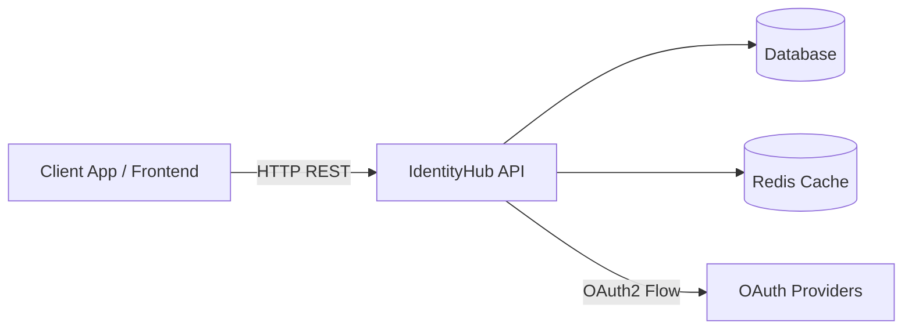
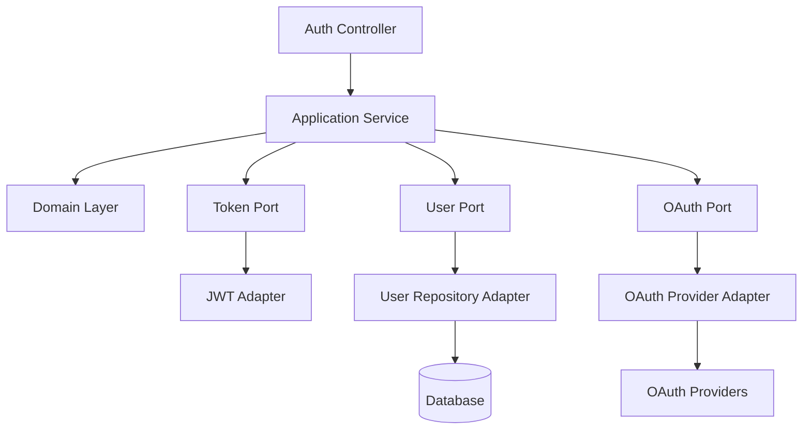
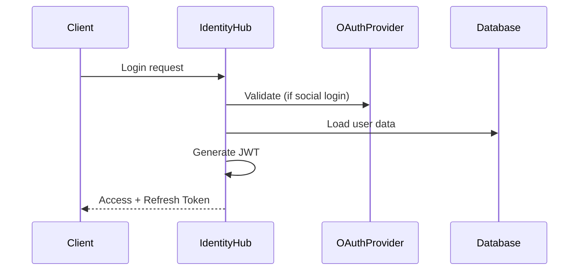

# 🔐 IdentityHub — Architecture & Requirements

## 📌 Overview

**IdentityHub** is a modern, extensible authentication and authorization service built with Java and Spring Boot.
It provides secure identity management through JWT, OAuth2 integration, and a modular architecture that allows it to be used either as a standalone microservice or embedded into other systems.

---

# 🎯 Objectives

* Provide authentication via multiple identity providers
* Issue secure tokens (JWT)
* Enable flexible authorization (RBAC)
* Be easily integrable into any backend system
* Follow modern architecture standards (Hexagonal / Clean Architecture)

---

# 📌 Functional Requirements

## 🔐 Authentication

* Email and password login

* OAuth2 login:

    * Google
    * GitHub
    * GitLab
    * (Optional: LinkedIn)

* Refresh token mechanism

* Logout with token invalidation

---

## 🪪 Token Management

* Generate:

    * Access Token (JWT)
    * Refresh Token

* JWT must include:

    * userId
    * roles
    * permissions
    * custom metadata

---

## 🛂 Authorization

* Role-Based Access Control (RBAC)
* Support for fine-grained permissions

Examples:

* `VIDEO_UPLOAD`
* `ADMIN`
* `USER_READ`

---

## 🔌 Integration APIs

* Token validation endpoint
* Token introspection endpoint
* Public keys endpoint (optional, for JWT verification)

---

## 🧩 Extensibility

* Ability to plug new authentication providers
* Ability to extend authorization logic
* Configurable claims and token structure

---

# ⚙️ Non-Functional Requirements

## 🏗 Architecture

* Hexagonal Architecture (Ports & Adapters)
* Clear separation:

    * Domain
    * Application
    * Infrastructure

---

## ⚡ Performance

* Low latency for token validation
* Optional caching layer (Redis)

---

## 🔒 Security

* Password hashing using BCrypt or Argon2

* Protection against:

    * Brute force attacks → (rate limit)
    * Token replay attacks
    * Query Injection

* HTTPS required

---

## 📦 Deployment

* Docker-ready
* Configuration via environment variables

---

## 📚 Observability

* Structured logging
* Metrics (Micrometer)
* Optional distributed tracing (OpenTelemetry)

---

# 🧱 Suggested Tech Stack

* Java 21
* Spring Boot 3
* Spring Security
* Spring Authorization Server (optional/custom)
* PostgreSQL
* Redis (optional)

---

# 🧭 Architecture Diagrams

## 🧩 1. High-Level Architecture (Container)



---

## 🧱 2. Internal Architecture (Hexagonal)



---

## 🔄 3. Authentication Flow (Sequence)



---

# 🧠 Domain Concepts

## Core Entities

* User (external reference)
* Credential
* Role
* Permission
* Token

---

## Key Responsibilities

### Domain Layer

* Authentication rules
* Token generation rules
* Authorization validation

---

### Application Layer

* Orchestrates flows
* Coordinates ports
* Handles use cases

---

### Infrastructure Layer

* Database access
* OAuth integrations
* JWT generation
* External services

---

# 🔌 Example Use Cases

## Login (Email/Password)

1. Validate credentials
2. Load user roles and permissions
3. Generate JWT
4. Return tokens

---

## Login (OAuth2)

1. Redirect to provider
2. Receive callback
3. Validate provider token
4. Map user
5. Generate JWT

---

## Token Validation

1. Receive token
2. Validate signature
3. Check expiration
4. Return claims

---

# 🚀 Future Enhancements

* Multi-tenant support
* API Keys authentication
* Rate limiting
* Admin UI
* Audit logs
* MFA (Multi-Factor Authentication)

---

# 📁 Suggested Project Structure

```
identityhub/
 ├── domain/
 ├── application/
 ├── infrastructure/
 ├── interfaces/
 ├── config/
```

---

# 📌 Final Notes

IdentityHub is designed as a **learning-driven, production-inspired system**, focusing on:

* Real-world architecture patterns
* Security best practices
* Extensibility and modularity
* Cloud-ready deployment

---
